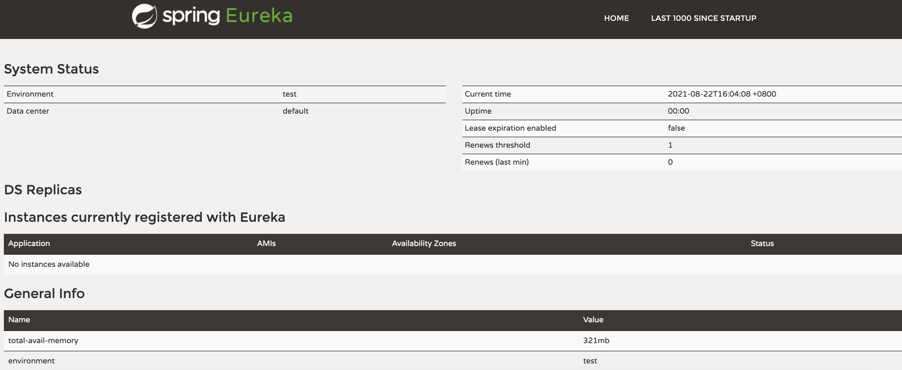

# 服务注册与发现


## 概述

服务组册中心使用的是 Spring Cloud Netflix 的服务注册和发现模块 Eureka。

## 创建项目

创建一个名为 `hello-spring-cloud-netflix` 的Maven项目。

### POM

POM文件配置如下：

```xml
<?xml version="1.0" encoding="UTF-8"?>
<project xmlns="http://maven.apache.org/POM/4.0.0" xmlns:xsi="http://www.w3.org/2001/XMLSchema-instance"
         xsi:schemaLocation="http://maven.apache.org/POM/4.0.0 http://maven.apache.org/xsd/maven-4.0.0.xsd">
    <modelVersion>4.0.0</modelVersion>

    <parent>
        <groupId>com.example</groupId>
        <artifactId>hello-spring-cloud-netflix-dependencies</artifactId>
        <version>1.0.0-SNAPSHOT</version>
        <relativePath>../hello-spring-cloud-netflix-dependencies/pom.xml</relativePath>
    </parent>

    <artifactId>hello-spring-cloud-netflix-eureka</artifactId>
    <packaging>jar</packaging>

    <dependencies>
        <!-- Spring Boot Begin -->
        <dependency>
            <groupId>org.springframework.boot</groupId>
            <artifactId>spring-boot-starter-test</artifactId>
            <scope>test</scope>
        </dependency>
        <!-- Spring Boot End -->

        <!-- Spring Cloud Begin -->
        <dependency>
            <groupId>org.springframework.cloud</groupId>
            <artifactId>spring-cloud-starter-netflix-eureka-server</artifactId>
        </dependency>
        <!-- Spring Cloud End -->
    </dependencies>

    <build>
        <plugins>
            <plugin>
                <groupId>org.springframework.boot</groupId>
                <artifactId>spring-boot-maven-plugin</artifactId>
                <configuration>
                    <mainClass>com.example.hello.spring.cloud.netflix.eureka.EurekaApplication</mainClass>
                </configuration>
            </plugin>
        </plugins>
    </build>
</project>
```

注意，mainClass 的配置指明SpringBoot项目打包成Jar之后运行的入口。

### Application

配置启动类，除了Spring Boot的`@SpringBootApplication` , 还需需要加注解 `@EnableEurekaServer`启动一个服务注册中心。

```java
package com.example.hello.spring.cloud.netflix.eureka;

import org.springframework.boot.SpringApplication;
import org.springframework.boot.autoconfigure.SpringBootApplication;
import org.springframework.cloud.netflix.eureka.server.EnableEurekaServer;

@SpringBootApplication
@EnableEurekaServer
public class EurekaApplication {

    public static void main(String[] args) {
        SpringApplication.run(EurekaApplication.class, args);
    }
}

```

### application.yml

Eureka 是一个高可用的组件，它没有后端缓存，每一个实例（客户端）注册之后需要向注册中心发送心跳（因此可以在内存中完成）。

在默认情况下 Erureka Server 也是一个 Eureka Client ，通过以下配置来表明自己是一个 Eureka Server。

-  `eureka.client.registerWithEureka:false` 
-  `eureka.client.fetchRegistry:false` 

```yaml
spring:
  application:
    name: hello-spring-cloud-netflix-eureka

server:
  port: 8761

eureka:
  instance:
    hostname: localhost
  client:
    registerWithEureka: false
    fetchRegistry: false
    serviceUrl:
      defaultZone: http://${eureka.instance.hostname}:${server.port}/eureka/
```

## 访问界面

Eureka Server 是有界面的，启动工程，打开浏览器访问：[http://localhost:8761](http://localhost:8761/)



