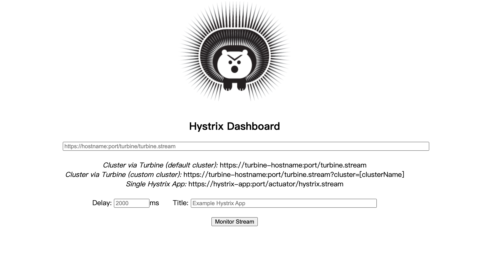
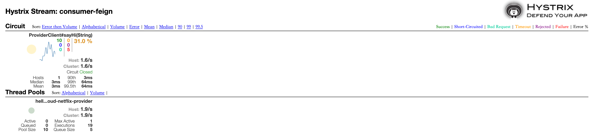

# 熔断器仪表盘-Hystrix Dashboard


## 概述

Hystrix Dashboard是一款针对Hystrix进行实时监控的工具，主要用来实时监控Hystrix的各项指标信息。通过Hystrix Dashboard我们可以在直观地看到各Hystrix Command的请求响应时间, 请求成功率等数据。通过Hystrix Dashboard反馈的实时信息，可以帮助我们快速发现系统中存在的问题。

Hystrix Dashboard只能看到单个应用内的Hystrix信息，单个应用增加 Hystrix Dashboard功能改造方式相同，SpringCloud对Hystrix Dashboard进行了整合，我以[服务消费者 - Feign](./spring-cloud-service-consumer-feign.html)改造为例。


## 配置Hystrix Dashboard

### POM

在 pom.xml 中增加依赖：

``` xml
<dependency>
  <groupId>org.springframework.cloud</groupId>
  <artifactId>spring-cloud-starter-netflix-hystrix-dashboard</artifactId>
</dependency>
```

### Application

在 Application 中增加 `@EnableHystrixDashboard` 注解

``` java
package hello.spring.cloud.netflix.consumer.feign;

import org.springframework.boot.SpringApplication;
import org.springframework.boot.autoconfigure.SpringBootApplication;
import org.springframework.cloud.client.discovery.EnableDiscoveryClient;
import org.springframework.cloud.netflix.hystrix.dashboard.EnableHystrixDashboard;
import org.springframework.cloud.openfeign.EnableFeignClients;

@SpringBootApplication
@EnableDiscoveryClient
@EnableFeignClients
@EnableHystrixDashboard
public class FeignConsumerApplication {

    public static void main(String[] args) {
        SpringApplication.run(FeignConsumerApplication.class, args);
    }

}
```

### Configuration Bean

创建 `hystrix.stream` 的 Servlet 配置Bean。Spring Boot 2.x 版本开启 Hystrix Dashboard 与 Spring Boot 1.x 的方式略有不同，需要增加一个 `HystrixMetricsStreamServlet` 的配置，代码如下：

``` java
package hello.spring.cloud.netflix.consumer.feign.config;

import com.netflix.hystrix.contrib.metrics.eventstream.HystrixMetricsStreamServlet;
import org.springframework.boot.web.servlet.ServletRegistrationBean;
import org.springframework.context.annotation.Bean;
import org.springframework.context.annotation.Configuration;

@Configuration
public class HystrixDashboardConfiguration {

    @Bean
    public ServletRegistrationBean getServlet() {
        HystrixMetricsStreamServlet streamServlet = new HystrixMetricsStreamServlet();
        ServletRegistrationBean registrationBean = new ServletRegistrationBean(streamServlet);
        registrationBean.setLoadOnStartup(1);
        registrationBean.addUrlMappings("/hystrix.stream");
        registrationBean.setName("HystrixMetricsStreamServlet");
        return registrationBean;
    }
    
}
```


## 测试Hystrix Dashboard

浏览器端访问 http://localhost:8765/hystrix 界面如下： 



Hystrix Dashboard配置：

URL：要监控的服务地址，http://localhost:8765/hystrix.stream。

Delay：监控的间隔时间，默认2秒。

Title：面板的标题，一般用服务名，consumer-feign。

点击 Monitor Stream，进入下一个界面。多次访问 http://localhost:8765/hi?msg=HelloFeign，可以看到熔断器的各项指标信息：



