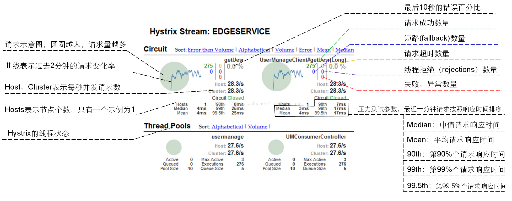

# Hystrix 其他相关说明

Hystrix 其他相关说明。


## 什么情况下会触发熔断

| 类型                 | 描述                                | 触发 fallback |
| -------------------- | ----------------------------------- | ------------- |
| EMIT                 | 值传递                              | NO            |
| SUCCESS              | 执行完成，没有错误                  | NO            |
| FAILURE              | 执行抛出异常                        | YES           |
| TIMEOUT              | 执行开始，但没有在允许的时间内完成  | YES           |
| BAD_REQUEST          | 执行抛出 HystrixBadRequestException | NO            |
| SHORT_CIRCUITED      | 断路器打开，不尝试执行              | YES           |
| THREAD_POOL_REJECTED | 线程池拒绝，不尝试执行              | YES           |
| SEMAPHORE_REJECTED   | 信号量拒绝，不尝试执行              | YES           |


## 什么情况下会抛出异常

| 类型              | 描述                            | 抛异常 |
| ----------------- | ------------------------------- | ------ |
| FALLBACK_EMIT     | Fallback 值传递                 | NO     |
| FALLBACK_SUCCESS  | Fallback 执行完成，没有错误     | NO     |
| FALLBACK_FAILURE  | Fallback 执行抛出出错           | YES    |
| FALLBACK_REJECTED | Fallback 信号量拒绝，不尝试执行 | YES    |
| FALLBACK_MISSING  | 没有 Fallback 实例              | YES    |


## 监控界面指标说明




## 常用配置说明

Hystrix的配置使用方法为在 Feign 接口的调用方法上增加注解，案例代码如下：

```java
@HystrixCommand(commandProperties = {
     @HystrixProperty(name = "execution.isolation.thread.timeoutInMilliseconds", value = "3000")
})
```

下面列出了一些常用配置的说明，[更多详细的配置参数说明见官网]( https://github.com/Netflix/Hystrix/wiki/Configuration)：

- **超时时间（默认 1000ms，单位：ms）**
  - `execution.isolation.thread.timeoutInMilliseconds`：在调用方配置，被该调用方的所有方法的超时时间都是该值，优先级低于下边的指定配置
  - `execution.isolation.thread.timeoutInMilliseconds`：在调用方配置，被该调用方的指定方法（HystrixCommandKey 方法名）的超时时间是该值
- **线程池核心线程数**
  - `coreSize`：默认为 10
- **Queue**
  - `maxQueueSize`：最大排队长度。默认 -1，使用 `SynchronousQueue`。其他值则使用 `LinkedBlockingQueue`。如果要从 -1 换成其他值则需重启，即该值不能动态调整，若要动态调整，需要使用到下边这个配置
  - `queueSizeRejectionThreshold`：排队线程数量阈值，默认为 5，达到时拒绝，如果配置了该选项，队列的大小是该队列（**注意：如果 `maxQueueSize=-1` 的话，则该选项不起作用**）
- **断路器**
  - `circuitBreaker.requestVolumeThreshold`：当在配置时间窗口内达到此数量的失败后，进行短路。默认 20 个（10s 内请求失败数量达到 20 个，断路器开）
  - `circuitBreaker.sleepWindowInMilliseconds`：短路多久以后开始尝试是否恢复，默认 5s
  - `circuitBreaker.errorThresholdPercentage`：出错百分比阈值，当达到此阈值后，开始短路。默认 50%
- **fallback**
  - `fallback.isolation.semaphore.maxConcurrentRequests`：调用线程允许请求 `HystrixCommand.GetFallback()` 的最大数量，默认 10。超出时将会有异常抛出，注意：该项配置对于 THREAD 隔离模式也起作用