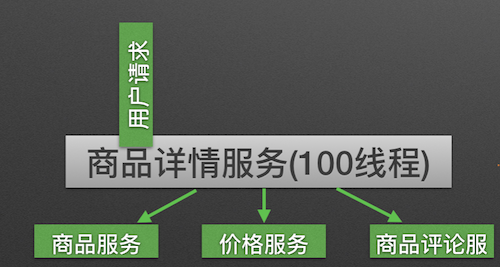
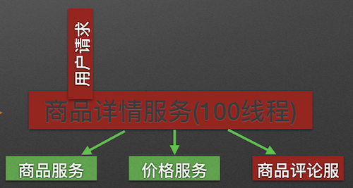
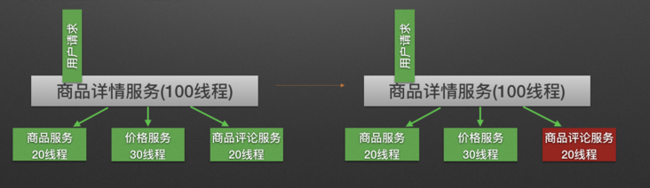
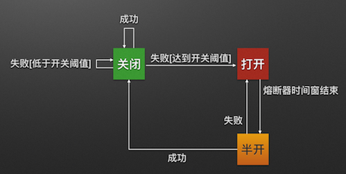
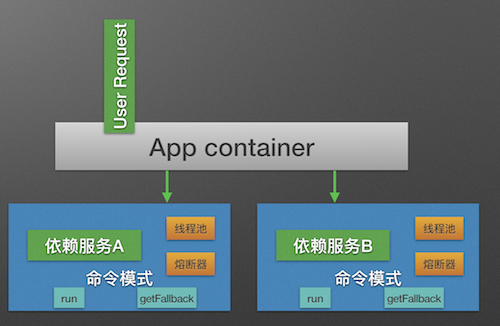
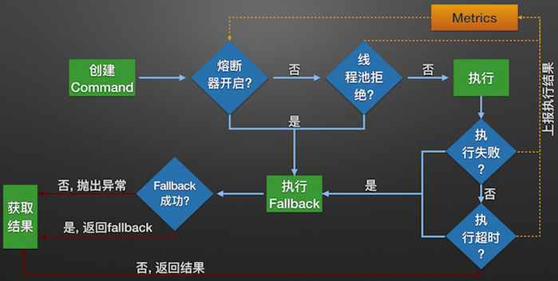
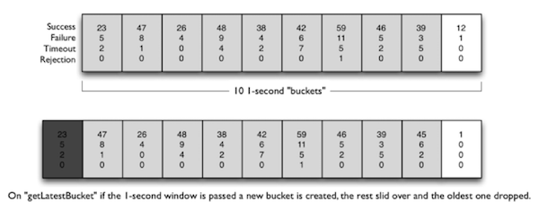

# Netflix Hystrix工作原理


## 概述

**Hystrix** 的中文含义是豪猪，因其背上长满了刺,而拥有自我保护能力。Netflix 的 Hystrix 是一个帮助解决分布式系统交互时超时处理和容错的类库，它同样拥有保护系统的能力，是防服务雪崩利器。


## Hystrix预防服务雪崩设计原则

Hystrix预防服务雪崩设计原则主要包括：资源隔离、熔断器模式、命令模式。

### 资源隔离

货船为了进行防止漏水和火灾的扩散，会将货仓分隔为多个（如下图），这种将资源隔离以减少风险的方式被称为：**Bulkheads**（舱壁隔离模式），Hystrix将这个模式运用到了服务调用者上。


在微服务系统中，我们实现的一个业务逻辑通常会依赖多个服务。比如，商品详情展示服务会依赖商品服务、价格服务、商品评论服务，如图所示:



**调用三个依赖服务会共享商品详情服务的线程池**，如果其中的商品评论服务不可用，就会出现线程池里所有线程都因等待响应而被**阻塞**，从而造成**服务雪崩**，如图所示：



**Hystrix通过将每个依赖服务分配独立的线程池进行资源隔离，从而避免服务雪崩**。如下图所示，当商品评论服务不可用时，即使商品服务独立分配的20个线程全部处于同步等待状态，也不会影响其他依赖服务的调用。



### 熔断器模式

熔断器模式定义了熔断器开关相互转换的逻辑：



熔断器开关相互转换是通过当前服务健康状况（请求失败数 / 请求总数）和设定阈值比较决定的：

1. 当熔断器开关关闭时，请求被允许通过熔断器。

   如果当前健康状况高于设定阈值，开关继续保持关闭。

   如果当前健康状况低于设定阈值，开关则切换为打开状态。

2. 当熔断器开关打开时，请求被禁止通过。

3. 当熔断器开关处于打开状态，经过一段时间后，熔断器会自动进入半开状态，这时熔断器只允许一个请求通过。

   当该请求调用成功时，熔断器恢复到关闭状态。若该请求失败，熔断器继续保持打开状态，接下来的请求被禁止通过。

总得来说，**熔断器的开关能保证服务调用者在调用异常服务时，快速返回结果，避免大量的同步等待。并且熔断器能在一段时间后继续侦测请求执行结果，提供恢复服务调用的可能**。


### 命令模式

Hystrix使用命令模式（继承HystrixCommand类）来包裹具体的服务调用逻辑（run方法），并在命令模式中添加了服务调用失败后的降级逻辑（getFallback），同时我们在Command的构造方法中可以定义当前服务线程池和熔断器的相关参数， 如下代码所示:

``` java
public class Service1HystrixCommand extends HystrixCommand<Response> {
  private Service1 service;
  private Request request;

  public Service1HystrixCommand(Service1 service, Request request){
    supper(
      Setter.withGroupKey(HystrixCommandGroupKey.Factory.asKey("ServiceGroup"))
          .andCommandKey(HystrixCommandKey.Factory.asKey("servcie1query"))
          .andThreadPoolKey(HystrixThreadPoolKey.Factory.asKey("service1ThreadPool"))
          .andThreadPoolPropertiesDefaults(HystrixThreadPoolProperties.Setter()
            .withCoreSize(20)) // 服务线程池数量
          .andCommandPropertiesDefaults(HystrixCommandProperties.Setter()
            .withCircuitBreakerErrorThresholdPercentage(60) // 熔断器关闭到打开阈值
            .withCircuitBreakerSleepWindowInMilliseconds(3000) // 熔断器打开到关闭的时间窗长度
      ))
      this.service = service;
      this.request = request;
    );
  }

  @Override
  protected Response run(){
    return service1.call(request);
  }

  @Override
  protected Response getFallback(){
    return Response.dummy();
  }
}
```

**在使用了Command模式构建了服务对象之后，服务便拥有了熔断器和线程池的功能**。




## Hystrix工作流程

Hystrix服务调用的工作流程：



1. 构建Hystrix的Command对象，调用执行方法。
2. Hystrix检查当前服务的熔断器开关是否开启，若开启，则执行降级服务getFallback方法。
3. 若熔断器开关关闭，则Hystrix检查当前服务的线程池是否能接收新的请求，若超过线程池已满，则执行降级服务getFallback方法。
4. 若线程池接受请求，则Hystrix开始执行服务调用具体逻辑run方法。
5. 若服务执行失败，则执行降级服务getFallback方法，并将执行结果上报**Metrics**更新服务健康状况。
6. 若服务执行超时，则执行降级服务getFallback方法，并将执行结果上报**Metrics**更新服务健康状况。
7. 若服务执行成功，返回正常结果。
8. 若服务降级方法getFallback执行成功，则返回降级结果。
9. 若服务降级方法getFallback执行失败，则抛出异常。

当[雪崩案例](./service-avalanche.html#雪崩案例)启用 Hystrix 封装了原有的远程调用请求后，流程图变为下图所示：


## Hystrix Metrics的实现

**Hystrix的Metrics中保存了当前服务的健康状况，包括服务调用总次数和服务调用失败次数等。根据Metrics的计数，熔断器从而能计算出当前服务的调用失败率，用来和设定的阈值比较从而决定熔断器的开关状态切换逻辑。因此Metrics的实现非常重要**。

### 1.4之前的滑动窗口实现

Hystrix在1.4.x之前的版本中使用自定义的滑动窗口数据结构来记录当前时间窗的各种事件（成功，失败，超时，线程池拒绝等）的计数。事件产生时， 滑动窗口数据结构根据当前时间来确定使用旧桶还是创建新桶来计数， 并在桶中对计数器经行修改，这些修改是多线程并发执行的， 代码中有不少加锁操作，逻辑较为复杂。



### 1.5之后的滑动窗口实现

Hystrix在1.5.x的版本中开始使用`RxJava`的`Observable.window()`实现滑动窗口。`RxJava`的`Observable.window()`使用后台线程创建新桶，避免了并发创建桶的问题。同时`RxJava`的单线程无锁特性也保证了计数变更时的线程安全，从而使代码更加简洁。
以下为我使用`Observable.window()`方法实现的一个简易滑动窗口Metrics，短短几行代码便能完成统计功能，足以证明`RxJava`的强大：

```java
@Test
public void timeWindowTest() throws Exception{
  Observable<Integer> source = Observable.interval(50, TimeUnit.MILLISECONDS).map(i -> RandomUtils.nextInt(2));
  source.window(1, TimeUnit.SECONDS).subscribe(window -> {
    int[] metrics = new int[2];
    window.subscribe(i -> metrics[i]++,
      InternalObservableUtils.ERROR_NOT_IMPLEMENTED,
      () -> System.out.println("窗口Metrics:" + JSON.toJSONString(metrics)));
  });
  TimeUnit.SECONDS.sleep(3);
}
```


## 参考

1. [防雪崩利器：熔断器 Hystrix 的原理与使用](https://segmentfault.com/a/1190000005988895) （好文，强烈推荐）

