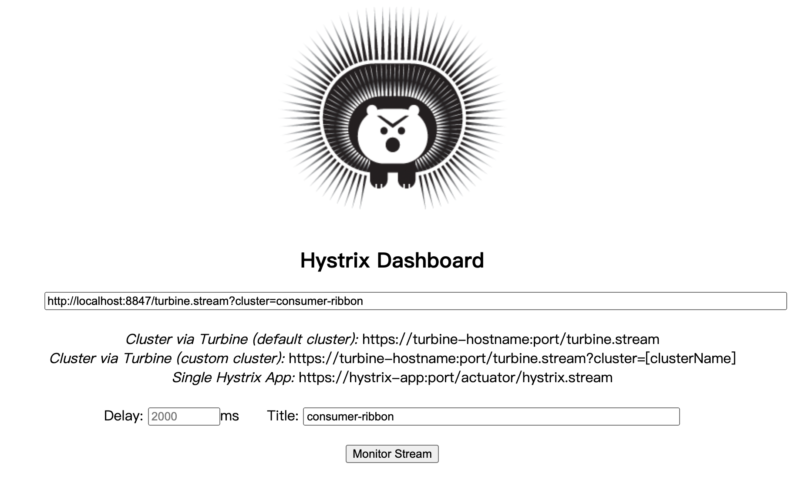
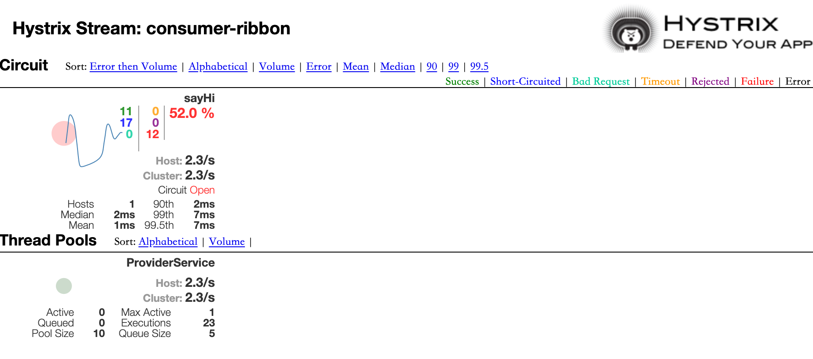

# 熔断器聚合仪表盘-Netflix Turbine


## 概述

在复杂的分布式系统中，相同服务的结点经常需要部署上百甚至上千个，很多时候，运维人员希望能够把相同服务的节点状态以一个整体集群的形式展现出来，这样可以更好的把握整个系统的状态。我们知道使用Hystrix Dashboard的话，只能看到单个应用内的服务信息，这明显不够。 

为此，Netflix 提供了一个开源项目 [Turbine](https://github.com/Netflix/Turbine) 。Turbine 是聚合服务器发送事件流数据的一个工具，它能把多个 `hystrix.stream` 的内容聚合为一个数据源供 Dashboard 展示，因此可以通过 Turbine 来监控集群下 Hystrix 的 Metrics 情况，


## 统一附加组件管理

创建一个名为 `hello-spring-cloud-netflix-addons` 的项目。该项目用于统一管理附加组件，我们将**Hystrix Dashboard**和**Hystrix Turbine**作为附加组件集成进项目中，增加可复用性。

项目结构：

``` html
-- hello-spring-cloud-netflix
   -- hello-spring-cloud-netflix-addons
      -- addons-hystrix-dashboard
      -- addons-hystrix-turbine
```

### POM

``` xml
<?xml version="1.0" encoding="UTF-8"?>
<project xmlns="http://maven.apache.org/POM/4.0.0" xmlns:xsi="http://www.w3.org/2001/XMLSchema-instance"
         xsi:schemaLocation="http://maven.apache.org/POM/4.0.0 https://maven.apache.org/xsd/maven-4.0.0.xsd">
    <modelVersion>4.0.0</modelVersion>

    <parent>
        <groupId>com.example</groupId>
        <artifactId>hello-spring-cloud-netflix-dependencies</artifactId>
        <version>1.0.0-SNAPSHOT</version>
        <relativePath>../hello-spring-cloud-netflix-dependencies/pom.xml</relativePath>
    </parent>

    <artifactId>hello-spring-cloud-netflix-addons</artifactId>
    <packaging>pom</packaging>

    <modules>
        <module>addons-hystrix-dashboard</module>
        <module>addons-hystrix-turbine</module>
    </modules>


</project>
```


## 创建hystrix-dashboard配置项目

创建一个名为 `addons-hystrix-dashboard` 的项目，该项目的主要作用是配置 `HystrixMetricsStreamServlet` 用以收集熔断信息，

消费者项目引入该项目依赖，修改一些配置即可开启`hystrix-dashboard`。

### POM

``` xml
<?xml version="1.0" encoding="UTF-8"?>
<project xmlns="http://maven.apache.org/POM/4.0.0" xmlns:xsi="http://www.w3.org/2001/XMLSchema-instance"
         xsi:schemaLocation="http://maven.apache.org/POM/4.0.0 https://maven.apache.org/xsd/maven-4.0.0.xsd">
    <modelVersion>4.0.0</modelVersion>
    <parent>
        <groupId>com.example</groupId>
        <artifactId>hello-spring-cloud-netflix-addons</artifactId>
        <version>1.0.0-SNAPSHOT</version>
        <relativePath>../pom.xml</relativePath>
    </parent>

    <artifactId>addons-hystrix-dashboard</artifactId>
    <packaging>jar</packaging>

    <dependencies>
        <dependency>
            <groupId>org.springframework.cloud</groupId>
            <artifactId>spring-cloud-starter-netflix-hystrix</artifactId>
        </dependency>
        <dependency>
            <groupId>org.springframework.cloud</groupId>
            <artifactId>spring-cloud-starter-netflix-hystrix-dashboard</artifactId>
        </dependency>
    </dependencies>

</project>
```

### Configuration

在 `addons-hystrix-dashboard` 项目中创建熔断器配置类：

``` java
package com.example.hello.spring.cloud.addons.hystrix.dashboard.configuration;

import com.netflix.hystrix.contrib.metrics.eventstream.HystrixMetricsStreamServlet;
import org.springframework.boot.web.servlet.ServletRegistrationBean;
import org.springframework.context.annotation.Bean;
import org.springframework.context.annotation.Configuration;

@Configuration
public class HystrixDashboardConfiguration {

    @Bean
    public ServletRegistrationBean getServlet() {
        HystrixMetricsStreamServlet streamServlet = new HystrixMetricsStreamServlet();
        ServletRegistrationBean registrationBean = new ServletRegistrationBean(streamServlet);
        registrationBean.setLoadOnStartup(1);
        // 配置收集端点路径
        registrationBean.addUrlMappings("/hystrix.stream");
        registrationBean.setName("HystrixMetricsStreamServlet");
        return registrationBean;
    }

}
```


## 创建熔断监控中心

创建一个名为 `addons-hystrix-turbine` 的项目，该项目用于统一收集集群中的熔断信息。

### POM

``` xml
<?xml version="1.0" encoding="UTF-8"?>
<project xmlns="http://maven.apache.org/POM/4.0.0" xmlns:xsi="http://www.w3.org/2001/XMLSchema-instance"
         xsi:schemaLocation="http://maven.apache.org/POM/4.0.0 https://maven.apache.org/xsd/maven-4.0.0.xsd">
    <modelVersion>4.0.0</modelVersion>
    <parent>
        <groupId>com.example</groupId>
        <artifactId>hello-spring-cloud-netflix-addons</artifactId>
        <version>1.0.0-SNAPSHOT</version>
        <relativePath>../pom.xml</relativePath>
    </parent>

    <artifactId>addons-hystrix-turbine</artifactId>
    <packaging>jar</packaging>

    <dependencies>
        <dependency>
            <groupId>org.springframework.cloud</groupId>
            <artifactId>spring-cloud-starter-netflix-eureka-client</artifactId>
        </dependency>
        <dependency>
            <groupId>org.springframework.cloud</groupId>
            <artifactId>spring-cloud-starter-netflix-hystrix-dashboard</artifactId>
        </dependency>
        <dependency>
            <groupId>org.springframework.cloud</groupId>
            <artifactId>spring-cloud-starter-netflix-turbine</artifactId>
        </dependency>
    </dependencies>

    <build>
        <plugins>
            <plugin>
                <groupId>org.springframework.boot</groupId>
                <artifactId>spring-boot-maven-plugin</artifactId>
                <configuration>
                    <mainClass>com.example.hello.spring.cloud.addons.hystrix.turbine.AddonsHystrixTurbineApplication</mainClass>
                </configuration>
            </plugin>
        </plugins>
    </build>

</project>
```

### Application

通过注解 `@EnableTurbine`，`@EnableHystrixDashboard` 开启 Hystrix Dashboard 和 Turbine 收集功能：

``` java
package com.example.hello.spring.cloud.addons.hystrix.turbine;

import org.springframework.boot.SpringApplication;
import org.springframework.boot.autoconfigure.SpringBootApplication;
import org.springframework.cloud.netflix.eureka.EnableEurekaClient;
import org.springframework.cloud.netflix.hystrix.dashboard.EnableHystrixDashboard;
import org.springframework.cloud.netflix.turbine.EnableTurbine;

@EnableTurbine
@EnableHystrixDashboard
@EnableEurekaClient
@SpringBootApplication
public class AddonsHystrixTurbineApplication {

    public static void main(String[] args) {
        SpringApplication.run(AddonsHystrixTurbineApplication.class, args);
    }

}
```

### application.yml

``` yaml
spring:
  main:
    allow-bean-definition-overriding: true
  application:
    name: addons-hystrix-turbine

server:
  port: 8847

eureka:
  instance:
    hostname: localhost
  client:
    serviceUrl:
      defaultZone: http://${eureka.instance.hostname}:8761/eureka/

turbine:
  # 可以让同一主机上的服务通过主机名与端口号的组合来进行区分
  # 默认情况下会以 HOST 来区分不同的服务，这会使得在本机调试的时候，本机上的不同服务聚合成一个服务来统计
  combine-host-port: true
  # 配置监控服务的列表，表明监控哪些服务多个使用 "," 分割
  app-config: hello-spring-cloud-netflix-consumer-ribbon
  # 用于指定集群名称，当服务数量非常多的时候，可以启动多个
  cluster-name-expression: metadata['cluster']
  aggregator:
    # 指定聚合哪些集群，多个使用 "," 分割，默认为 default
    cluster-config: consumer-ribbon
  # 用于替换源码 org.springframework.cloud.netflix.turbine.SpringClusterMonitor 中的收集端点
  # 我们配置的 Servlet 指向了 /hystrix.stream，Turbine 默认收集端点为 /actuator/hystrix.stream
  instanceUrlSuffix: /hystrix.stream
```


## 消费者开启熔断监控

这里以[服务消费者 - Ribbon](./spring-cloud-service-consumer-ribbon.html)为例。

### POM

修改消费者 POM，增加刚才创建的 `addons-hystrix-dashboard` 项目依赖：

``` xml
<!-- Addons Begin-->
<dependency>
  <groupId>com.example</groupId>
  <artifactId>addons-hystrix-dashboard</artifactId>
</dependency>
<!-- Addons End -->
```

注意：如果项目之前引入了`spring-cloud-starter-netflix-hystrix`和`spring-cloud-starter-netflix-hystrix-dashboard`请移除依赖。

### Application

修改 Application 的 `@SpringBootApplication` 注解的扫描路径，让 Spring 可以扫描到 `addons-hystrix-dashboard` 项目中的 Java 配置（`HystrixDashboardConfiguration`）：

``` java
package com.example.hello.spring.cloud.netflix.consumer.ribbon;

import org.springframework.boot.SpringApplication;
import org.springframework.boot.autoconfigure.SpringBootApplication;
import org.springframework.cloud.client.discovery.EnableDiscoveryClient;
import org.springframework.cloud.netflix.hystrix.EnableHystrix;

@SpringBootApplication(scanBasePackages = "com.example.hello.spring.cloud")
@EnableDiscoveryClient
@EnableHystrix
public class RibbonConsumerApplication {

    public static void main(String[] args) {
        SpringApplication.run(RibbonConsumerApplication.class, args);
    }

}
```

### application.yml

修改 `application.yml` 的eureka配置：

``` yaml
eureka:
  instance:
    hostname: localhost
    # 增加用于集群的配置，集群名为 consumer-ribbon，与 Turbine 的配置匹配
    metadata-map:
      cluster: consumer-ribbon
  client:
    serviceUrl:
      defaultZone: http://${eureka.instance.hostname}:8761/eureka/
```


## 测试熔断收集功能

浏览器访问：http://localhost:8847/turbine.stream?cluster=consumer-ribbon ，查看熔断监控中心的监控流，在没有访问消费者接口的情况下， 浏览器输出如下：

``` html
: ping
data: {"reportingHostsLast10Seconds":0,"name":"meta","type":"meta","timestamp":1630217275515}

: ping
data: {"reportingHostsLast10Seconds":0,"name":"meta","type":"meta","timestamp":1630217278516}

: ping
data: {"reportingHostsLast10Seconds":0,"name":"meta","type":"meta","timestamp":1630217281521}

: ping
data: {"reportingHostsLast10Seconds":0,"name":"meta","type":"meta","timestamp":1630217285522}
```

调用消费者接口：http://localhost:8764/hi?msg=HelloRibbon，观察监控流信息变化，等待一小会可以发现已经收集到了集群信息：

``` html
: ping
data: {"currentCorePoolSize":10,"currentLargestPoolSize":10,"propertyValue_metricsRollingStatisticalWindowInMilliseconds":10000,"currentActiveCount":0,"currentMaximumPoolSize":10,"currentQueueSize":0,"type":"HystrixThreadPool","currentTaskCount":46,"currentCompletedTaskCount":46,"rollingMaxActiveThreads":0,"rollingCountCommandRejections":0,"name":"ProviderService","reportingHosts":1,"currentPoolSize":10,"propertyValue_queueSizeRejectionThreshold":5,"rollingCountThreadsExecuted":0}
```

::: tip 提示

如果一直没有集群信息，可以从以下两个方向检查：

1. 消费者是否扫描到了HystrixDashboardConfiguration配置。尝试访问消费者的监控流查看是否开启，例如示例中http://localhost:8764/hystrix.stream
2. 查看消费者和熔断监控中心的application.yml配置是否匹配。

:::

进入 Hystrix Dashboard 控制台集中查看监控信息，访问：http://localhost:8847/hystrix



可以尝试开启多个消费者服务或停止服务提供者，触发消费者熔断，可以在一个控制台监控到了集群状态：

