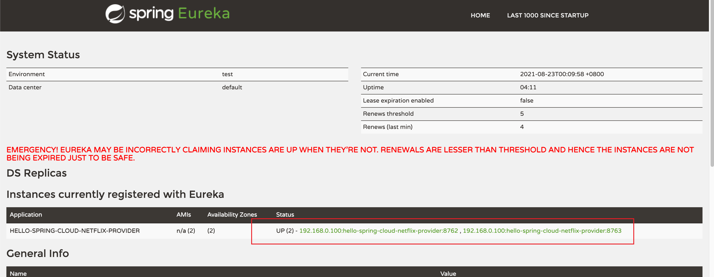

# 服务消费者 - Ribbon


## 概述

在微服务架构中，业务都会被拆分成一个独立的服务，服务与服务的通讯基于多种跨进程的方式进行通信协作，而在`Spring Cloud`架构中比较常见的跨进程的方式是RESTful HTTP请求和RPC调用。这两种方式的实现方案有：

- RESTful HTTP请求：Ribbon + RestTemplate，
- RPC调用：Feign。

在这一篇文章首先讲解下基于 Ribbon + RestTemplate。


## Ribbon简介

**Ribbon 是Netflix发布的负载均衡器，是一个客户端实现负载均衡处理的服务调用组件**。它有助于控制HTTP和TCP的客户端的行为。为Ribbon配置服务提供者地址后，Ribbon就可基于某种负载均衡算法，自动地帮助服务消费者去请求。Ribbon默认为我们提供了很多负载均衡算法，例如轮询、随机等。当然，我们也可为Ribbon实现自定义的负载均衡算法。

在Spring Cloud中，当Ribbon与Eureka配合使用时，Ribbon可自动从Eureka Server获取服务提供者地址列表，并基于负载均衡算法，请求其中一个服务提供者实例。

Ribbon的负载均衡主要是通过LoadBalancerClient来实现的，而LoadBalancerClient具体交给了ILoadBalancer来处理，ILoadBalancer通过配置IRule、IPing等，向Eureka Server获取注册列表信息，默认每10秒向Eureka Server发送一次“ping”，进而检查是否需要更新服务的注册列表信息。最后，在得到服务注册列表信息后，ILoadBalancer根据IRule的策略进行负载均衡。而RestTemplate加上@LoadBalanced注解后，在远程调度时能够负载均衡，主要维护了一个被@LoadBalanced注解的RestTemplate列表，并给该列表中的RestTemplate对象添加了拦截器。在拦截器的方法中，将远程调度方法交给了Ribbon的负载均衡器LoadBalancerClient去处理，从而达到了负载均衡的目的。


## 演示案例方案

- 一个服务注册中心，Eureka Server，端口号为：`8761`
- 运行了两个服务提供者(`hello-spring-cloud-netflix-provider` )实例，端口号分别为：`8762`，`8763`
- 运行了一个服务消费者(`hello-spring-cloud-netflix-consumer-ribbon` )，端口号为：`8764`
- 服务消费者通过 `RestTemplate` 调用服务提供者接口时因为启用了负载均衡功能，故会轮流调用两个服务提供者，请求接口结果反复依次显示 `8762` 和 `8763` 端口


## 服务提供者集群

启动两个[服务提供者](./spring-cloud-service-provider.html)(`hello-spring-cloud-netflix-provider`)，端口分别为：`8762`、`8763`，启动后在 Eureka 中会注册两个实例，这相当于一个小集群

在 IDEA 中配置一个工程启动多个实例：

1. 点击 `Run -> Edit Configurations...`
2. 选择需要启动多实例的项目，旧版本的IDEA去掉 `Single instance only` 前面的勾，新版本的勾选 `Allow parallel run `。
3. 通过修改 `application.yml` 配置文件的 `server.port` 的端口，启动多个实例，需要多个端口，分别进行启动即可。




## 创建服务消费者

创建一个工程名为 `hello-spring-cloud-netflix-consumer-ribbon` 的服务消费者项目，目的通过Ribbon + RestTemplate的方式调用服务提供者的http://hello-spring-cloud-netflix-provider:8762/hi?msg=HelloProvider接口，并能够体现Ribbon的负载均衡机制。

### POM

`pom.xml` 配置如下：

```xml
<?xml version="1.0" encoding="UTF-8"?>
<project xmlns="http://maven.apache.org/POM/4.0.0" xmlns:xsi="http://www.w3.org/2001/XMLSchema-instance"
         xsi:schemaLocation="http://maven.apache.org/POM/4.0.0 http://maven.apache.org/xsd/maven-4.0.0.xsd">
    <modelVersion>4.0.0</modelVersion>

    <parent>
        <groupId>com.example</groupId>
        <artifactId>hello-spring-cloud-netflix-dependencies</artifactId>
        <version>1.0.0-SNAPSHOT</version>
        <relativePath>../hello-spring-cloud-netflix-dependencies/pom.xml</relativePath>
    </parent>

    <artifactId>hello-spring-cloud-netflix-consumer-ribbon</artifactId>
    <packaging>jar</packaging>

    <dependencies>
        <!-- Spring Boot Begin -->
        <dependency>
            <groupId>org.springframework.boot</groupId>
            <artifactId>spring-boot-starter-web</artifactId>
        </dependency>
        <dependency>
            <groupId>org.springframework.boot</groupId>
            <artifactId>spring-boot-starter-tomcat</artifactId>
        </dependency>
        <dependency>
            <groupId>org.springframework.boot</groupId>
            <artifactId>spring-boot-starter-thymeleaf</artifactId>
        </dependency>
        <dependency>
            <groupId>org.springframework.boot</groupId>
            <artifactId>spring-boot-starter-actuator</artifactId>
        </dependency>
        <dependency>
            <groupId>org.springframework.boot</groupId>
            <artifactId>spring-boot-starter-test</artifactId>
            <scope>test</scope>
        </dependency>
        <!-- Spring Boot End -->

        <!-- Spring Cloud Begin -->
        <dependency>
            <groupId>org.springframework.cloud</groupId>
            <artifactId>spring-cloud-starter-netflix-eureka-server</artifactId>
        </dependency>
      
        <dependency>
            <groupId>org.springframework.cloud</groupId>
            <artifactId>spring-cloud-starter-netflix-ribbon</artifactId>
        </dependency>
      
        <!-- Spring Cloud End -->

        <!-- 解决 thymeleaf 模板引擎一定要执行严格的 html5 格式校验问题 -->
        <dependency>
            <groupId>net.sourceforge.nekohtml</groupId>
            <artifactId>nekohtml</artifactId>
        </dependency>
    </dependencies>

    <build>
        <plugins>
            <plugin>
                <groupId>org.springframework.boot</groupId>
                <artifactId>spring-boot-maven-plugin</artifactId>
                <configuration>
                    <mainClass>hello.spring.cloud.netflix.consumer.ribbon.RibbonConsumerApplication</mainClass>
                </configuration>
            </plugin>
        </plugins>
    </build>
</project>
```

这里将该服务当成了拥有页面的Web服务，引入了一些模版引擎的依赖，其实主要是增加了`spring-cloud-starter-netflix-ribbon`的依赖。


### Application

由于是消费者，需要开启 `@EnableDiscoveryClient` 配置，让消费者去到Eureka Server发现服务。是不需要`@EnableEurekaServer`和`@EnableEurekaClient`的，注意区分他们之间的作用。

```java
package hello.spring.cloud.netflix.consumer.ribbon;

import org.springframework.boot.SpringApplication;
import org.springframework.boot.autoconfigure.SpringBootApplication;
import org.springframework.cloud.client.discovery.EnableDiscoveryClient;

@SpringBootApplication
@EnableDiscoveryClient
public class RibbonConsumerApplication {

    public static void main(String[] args) {
        SpringApplication.run(RibbonConsumerApplication.class, args);
    }

}

```


### application.yml

配置Eureka Server地址，设置程序端口号为：`8764`

```yaml
spring:
  application:
    name: hello-spring-cloud-netflix-consumer-ribbon
  thymeleaf:
    cache: false
    mode: LEGACYHTML5
    encoding: UTF-8
    servlet:
      content-type: text/html

server:
  port: 8764

eureka:
  client:
    serviceUrl:
      defaultZone: http://localhost:8761/eureka/
```


### Configuration

编写ConfigurationBean，配置注入 `RestTemplate` 的 Bean，并通过 `@LoadBalanced` 注解表明开启负载均衡功能:

```java
package hello.spring.cloud.netflix.consumer.ribbon.config;

import org.springframework.cloud.client.loadbalancer.LoadBalanced;
import org.springframework.context.annotation.Bean;
import org.springframework.context.annotation.Configuration;
import org.springframework.web.client.RestTemplate;

@Configuration
public class RestTemplateConfiguration {

    @Bean
    @LoadBalanced
    public RestTemplate restTemplate() {
        return new RestTemplate();
    }

}

```


### ServiceTest

在这里，我们将服务提供者提供的接口封装在一个Service，注意的是我们用的服务名`hello-spring-cloud-netflix-provider`替代了具体的 URL 地址，在 Ribbon 中它会根据服务名来选择具体的服务实例，在请求的时候会根据服务实例用具体的 URL 替换掉服务名去请求：

```java
package hello.spring.cloud.netflix.consumer.ribbon.service;

import org.springframework.beans.factory.annotation.Autowired;
import org.springframework.stereotype.Service;
import org.springframework.web.client.RestTemplate;

@Service
public class ProviderService {

    @Autowired
    private RestTemplate restTemplate;

    public String sayHi(String message) {
        return restTemplate.getForObject("http://hello-spring-cloud-netflix-provider/hi?msg=" + message, String.class);
    }

}

```


### ControllerTest

```java
package hello.spring.cloud.netflix.consumer.ribbon.ctrl;

import hello.spring.cloud.netflix.consumer.ribbon.service.ProviderService;
import org.springframework.beans.factory.annotation.Autowired;
import org.springframework.web.bind.annotation.GetMapping;
import org.springframework.web.bind.annotation.RequestParam;
import org.springframework.web.bind.annotation.RestController;

@RestController
public class RibbonConsumerCtrl {

    @Autowired
    private ProviderService providerService;

    @GetMapping(value = "hi")
    public String sayHi(@RequestParam(value = "msg", required = false) String msg) {
        return providerService.sayHi(msg);
    }
    
}

```


## 测试访问

在浏览器上多次访问 http://localhost:8764/hi?msg=HelloRibbon

浏览器交替显示：

```html
Hi，your message is :"HelloRibbon" i am from port：8762
Hi，your message is :"HelloRibbon" i am from port：8763
```

请求成功则表示我们已经成功通过Ribbon + RestTemplate实现了负载均衡访问不同端口的实例。


## 参考

1. [Ribbon负载均衡](https://www.huaweicloud.com/articles/5f52e56a9c5fd03e3407f8346779a9df.html)