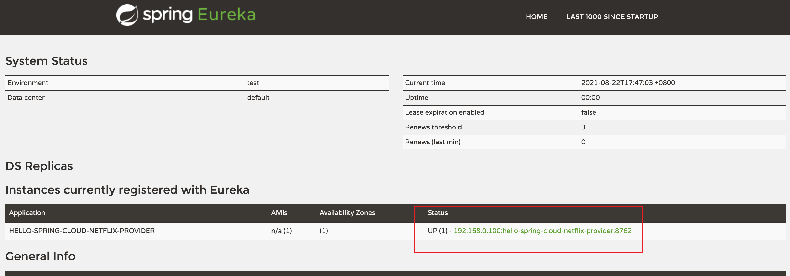

# 服务提供者


## 概述

当 Eureka Client 向 Eureka Server 注册时，它会提供一些元数据，例如主机和端口，URL，主页等。

Eureka Server 从每个 Client 实例接收心跳消息。 如果心跳超时，则通常将该实例从 Eureka Server 中删除。

## 创建项目

创建一个名为 `hello-spring-cloud-netflix-provider` 的项目，向Eureka Server注册服务。它作为一个服务提供者的代表，在实际项目中可能是一个管理后台服务、订单服务、门户服务等等。

### POM

```xml
<?xml version="1.0" encoding="UTF-8"?>
<project xmlns="http://maven.apache.org/POM/4.0.0" xmlns:xsi="http://www.w3.org/2001/XMLSchema-instance"
         xsi:schemaLocation="http://maven.apache.org/POM/4.0.0 http://maven.apache.org/xsd/maven-4.0.0.xsd">
    <modelVersion>4.0.0</modelVersion>

    <parent>
        <groupId>com.example</groupId>
        <artifactId>hello-spring-cloud-netflix-dependencies</artifactId>
        <version>1.0.0-SNAPSHOT</version>
        <relativePath>../hello-spring-cloud-netflix-dependencies/pom.xml</relativePath>
    </parent>

    <artifactId>hello-spring-cloud-netflix-provider</artifactId>
    <packaging>jar</packaging>

    <dependencies>
        <!-- Spring Boot Begin -->
        <dependency>
            <groupId>org.springframework.boot</groupId>
            <artifactId>spring-boot-starter-test</artifactId>
            <scope>test</scope>
        </dependency>
        <!-- Spring Boot End -->

        <!-- Spring Cloud Begin -->
        <dependency>
            <groupId>org.springframework.cloud</groupId>
            <artifactId>spring-cloud-starter-netflix-eureka-server</artifactId>
        </dependency>
        <!-- Spring Cloud End -->
    </dependencies>

    <build>
        <plugins>
            <plugin>
                <groupId>org.springframework.boot</groupId>
                <artifactId>spring-boot-maven-plugin</artifactId>
                <configuration>
                    <mainClass>com.example.hello.spring.cloud.netflix.provider.ProviderApplication</mainClass>
                </configuration>
            </plugin>
        </plugins>
    </build>
</project>
```


### Application

通过注解 `@EnableEurekaClient` 表明自己是一个 Eureka Client。

```java
package com.example.hello.spring.cloud.netflix.provider;

import org.springframework.boot.SpringApplication;
import org.springframework.boot.autoconfigure.SpringBootApplication;
import org.springframework.cloud.netflix.eureka.EnableEurekaClient;

@SpringBootApplication
@EnableEurekaClient
public class ProviderApplication {

    public static void main(String[] args) {
        SpringApplication.run(ProviderApplication.class, args);
    }

}

```


### application.yml

```yaml
spring:
  application:
    name: hello-spring-cloud-netflix-provider

server:
  port: 8762

eureka:
  client:
    serviceUrl:
      defaultZone: http://localhost:8761/eureka/
```

**注意： 需要指明 `spring.application.name`，在以后的服务与服务之间相互调用一般都是根据这个 `name`**。

### Controller

```java
package com.example.hello.spring.cloud.netflix.provider.ctrl;

import org.springframework.beans.factory.annotation.Value;
import org.springframework.web.bind.annotation.GetMapping;
import org.springframework.web.bind.annotation.RequestParam;
import org.springframework.web.bind.annotation.RestController;

@RestController
public class ProviderCtrl {

    @Value("${server.port}")
    private String port;

    @GetMapping(value = "hi")
    public String sayHi(@RequestParam(value = "msg", required = false) String msg) {
        return String.format("Hi，your message is : %s i am from port : %s", msg, port);
    }

}

```


## 查询服务注册情况

启动工程，打开 Eureka Server 的网址，查询服务注册情况：



我们可以发现服务 `hello-spring-cloud-netflix-provider` 已经注册在到Eureka Server，它来自机器192.168.0.100，端口号为8762。

打开 http://localhost:8762/hi?msg=HelloProvider，你会在浏览器上看到 :

```html
Hi，your message is : HelloProvider i am from port : 8762
```