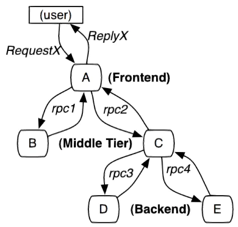

# ZipKin架构

本文主要是翻译官方的[ZipKin Architecture](https://zipkin.io/pages/architecture.html)，以及加上一些自己的理解。

### 概述

跟踪程序（Tracer）存在于应用程序中，并记录有关所发生操作的时间和元数据。 他们经常作为仪器库（ instrument libraries），因此它们的使用对用户是透明的。 例如，一个被检测的 Web 服务器会记录它何时收到请求以及何时发送响应。 收集的跟踪数据称为跨度（Span）。

仪器（Instrumentation）的编写是为了在生产中安全，并有很少的开销。因此，他们只在踪链带内（in-band）传播ID（traceId），告诉接收方正在进行跟踪。完成的跨度会向带外（out-of-band）的Zipkin报告，类似于应用程序异步报告指标的方式。例如，当一个操作被跟踪并且需要发出一个 http 请求时，会添加一些标头（heards）来传播ID。标头不用于发送操作名称等详细信息。

在一个被检测的应用程序中，向Zipkin发送数据的组件被称为Reporter。Reporter通过多种传输方式之一将跟踪数据发送给Zipkin收集器（Collector），收集器将跟踪数据保存到存储器(Storage)中。最后，API查询存储以向UI提供数据。


`ZipKin` 总体采用的是C/S架构。客户端采集数据后异步发送给服务端用来展示数据。在每个Instrumented的客户端，写入了TraceId，然后统一收集数据在服务端存储。这里Instrumented翻译为仪器化，代表一个接入了ZipKin的客户端（ZipKin 提供了追踪仪，接入了ZipKin的客户端相当于绑了一个追踪仪器）。


## 流程例子

如概述中所述，标识符（traceId、spanId）在踪链带内发送，详细信息在踪链带外发送到 Zipkin。 在这两种情况下，跟踪仪器负责创建有效的跟踪并正确呈现它们。 例如，跟踪器确保它在踪链带内（下游）和踪链带外（异步到 Zipkin）发送的数据之间的奇偶校验。

这是 http 跟踪的示例序列，其中用户代码调用资源`/foo`。这将导致在用户代码接收到http响应后Reporter异步发送给Zipkin的单个span。

``` xml
┌─────────────┐ ┌───────────────────────┐  ┌─────────────┐  ┌──────────────────┐
│ User Code   │ │ Trace Instrumentation │  │ Http Client │  │ Zipkin Collector │
└─────────────┘ └───────────────────────┘  └─────────────┘  └──────────────────┘
       │                 │                         │                 │
           ┌─────────┐
       │ ──┤GET /foo ├─▶ │ ────┐                   │                 │
           └─────────┘         │ record tags
       │                 │ ◀───┘                   │                 │
                           ────┐
       │                 │     │ add trace headers │                 │
                           ◀───┘
       │                 │ ────┐                   │                 │
                               │ record timestamp
       │                 │ ◀───┘                   │                 │
                             ┌─────────────────┐
       │                 │ ──┤GET /foo         ├─▶ │                 │
                             │X-B3-TraceId: aa │     ────┐
       │                 │   │X-B3-SpanId: 6b  │   │     │           │
                             └─────────────────┘         │ invoke
       │                 │                         │     │ request   │
                                                         │
       │                 │                         │     │           │
                                 ┌────────┐          ◀───┘
       │                 │ ◀─────┤200 OK  ├─────── │                 │
                           ────┐ └────────┘
       │                 │     │ record duration   │                 │
            ┌────────┐     ◀───┘
       │ ◀──┤200 OK  ├── │                         │                 │
            └────────┘       ┌────────────────────────────────┐
       │                 │ ──┤ asynchronously report span     ├────▶ │
                             │                                │
                             │{                               │
                             │  "traceId": "aa",              │
                             │  "id": "6b",                   │
                             │  "name": "get",                │
                             │  "timestamp": 1483945573944000,│
                             │  "duration": 386000,           │
                             │  "annotations": [              │
                             │--snip--                        │
                             └────────────────────────────────┘
```

跟踪检测报告（Reporter）异步地扩展，是为了防止与跟踪系统相关的延迟或故障延迟或破坏用户代码。由追踪仪（Trace Instrumentation ）发送的跨度（Span）必须从被跟踪的服务传输到Zipkin收集者。有三个主要的传输方式（Transport）:HTTP，Kafka和Scribe。

## 组件

ZipKin主要由4个核心组件构成：

### Collector

收集器组件，它主要用于验证和处理从外部系统发送过来的跟踪信息，将这些信息转换为Zipkin内部处理的Span格式，以支持后续的存储、分析、检索展示等功能。

### Storage

存储组件，它主要对处理收集器接收到的跟踪信息，默认会将这些信息存储在内存中，我们也可以修改此存储策略，通过使用其他存储组件将跟踪信息存储到 数据库或es 中。Zipkin 最初是为了在 Cassandra 上存储数据而构建的，因为 Cassandra 是可扩展的，具有灵活的架构，并且在 Twitter 中被大量使用。 除了 Cassandra，原生支持 ElasticSearch 和 MySQL，其他存储方式可能作为第三方扩展提供。

### Search-API

RESTful API组件。一旦数据被存储和索引，我们需要一种方法来提取它， 查询守护进程提供了一个简单的 JSON API 来查找和检索跟踪。 此 API 的主要使用者是 Web UI。它主要用来提供外部访问接口。比如给客户端展示跟踪信息，或是外接系统访问以实现监控等。

### Web UI

Web UI组件，基于API组件实现的上层应用。它提供了一个用于查看跟踪的漂亮界面，通过UI组件用户可以方便而有直观地查询和分析跟踪信息。 注意：UI 中没有内置身份验证！

## 相关概念

### Trace

一系列 Spans 组成的一个树状结构。Zipkin使用Trace结构表示对一次请求的跟踪，一次请求可能由后台的若干服务负责处理，每个服务的处理是一个Span，Span之间有依赖关系，Trace就是树结构的Span集合，Trace以一个64 位 ID 表示。



### Span

Zipkin基本工作单元。每个服务的处理跟踪是一个Span，包含了一些描述信息：id，parentId，name，timestamp，duration，annotations等。例如：

``` json
{
      "traceId": "bd7a977555f6b982", #标记一次请求的跟踪，相关的Spans都有相同的traceId；
      "name": "get-traces", #span的名称，一般是接口方法的名称
      "id": "ebf33e1a81dc6f71", #span id
      "parentId": "bd7a977555f6b982",   # 可选的id，当前Span的父Span id, Spans之间依赖关系的字段
      "timestamp": 1458702548478000, # Span创建时的时间戳，使用的单位是微秒
      "duration": 354374, # 持续时间，使用的单位是微秒（避免主机间的时间偏差）
      "annotations": [
        {
          "endpoint": {
            "serviceName": "zipkin-query",
            "ipv4": "192.168.1.2",
            "port": 9411
          },
          "timestamp": 1458702548786000,
          "value": "cs"
        }
      ],
      "binaryAnnotations": [
        {
          "key": "lc",
          "value": "JDBCSpanStore",
          "endpoint": {
            "serviceName": "zipkin-query",
            "ipv4": "192.168.1.2",
            "port": 9411
          }
        }
      ]
}
```

### Annotation：

用来及时记录一个事件的存在，一些核心 Annotations 用来定义一个请求的开始和结束

- cs：Client Sent，客户端发起一个请求，这个 Annotation 描述了这个 Span 的开始
- sr：Server Received，服务端获得请求并准备开始处理它，**如果将其 sr 减去 cs 时间戳便可得到网络延迟**
- ss：Server Sent 表明请求处理的完成(当请求返回客户端)，**如果 ss 减去 sr 时间戳便可得到服务端需要的处理请求时间**
- cr：Client Received 表明 Span 的结束，客户端成功接收到服务端的回复，**如果 cr 减去 cs 时间戳便可得到客户端从服务端获取回复的所有所需时间**