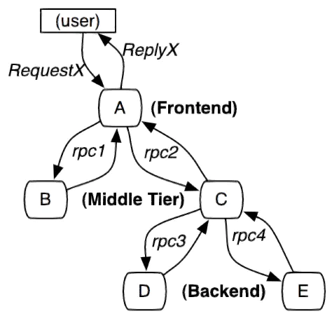

# 服务链路追踪-ZipKin

微服务架构是通过业务来划分服务的，使用 REST或RPC 调用。对外暴露的一个接口，可能需要很多个服务协同才能完成这个接口功能，如果链路上任何一个服务出现问题或者网络超时，都会形成导致接口调用失败。随着业务的不断扩张，服务之间互相调用会越来越复杂。随着服务的越来越多，对调用链的分析会越来越复杂。它们之间的调用关系也许如下。

| 对外暴露的一个功能接口                                     | 业务复杂的微服务系统                                       |
| ---------------------------------------------------------- | ---------------------------------------------------------- |
|  |  |

因此，对服务调用链进行监控是非常必要的。


## ZipKin概述

[`ZipKin`](https://zipkin.io/) 是一个 Twitter 公司开源的分布式追踪系统，它致力于收集服务的计时数据，以解决微服务架构中的延迟问题，功能包括数据的收集、存储、查找和展现。它的理论模型来自于[ Google Dapper](https://bigbully.github.io/Dapper-translation/) 论文。

各业务系统在彼此调用时，将特定的跟踪消息传递至 ZipKin，Zipkin在收集到跟踪信息后将其聚合处理、存储、ZipKin UI 展示等，开发者可以通过 ZipKin UI 生成的依赖关系图，便获得网络延迟、调用链路、系统依赖等等，让开发者轻松的收集和分析数据，方便监测系统中存在的瓶颈。


## 架构概览

`ZipKin` 总体采用的是C/S架构。客户端采集数据后异步发送给服务端用来展示数据。在每个Instrumented的客户端，写入了TraceId，然后统一收集数据在服务端存储。这里Instrumented翻译为仪器化，代表一个接入了ZipKin的客户端。


Zipkin的基础架构，主要由4个核心组件构成：

- **Collector**：收集器组件，它主要用于处理从外部系统发送过来的跟踪信息，将这些信息转换为Zipkin内部处理的Span格式，以支持后续的存储、分析、展示等功能。
- **Storage**：存储组件，它主要对处理收集器接收到的跟踪信息，默认会将这些信息存储在内存中，我们也可以修改此存储策略，通过使用其他存储组件将跟踪信息存储到 数据库或es 中。
- **API**：RESTful API组件，它主要用来提供外部访问接口。比如给客户端展示跟踪信息，或是外接系统访问以实现监控等。
- **UI**：Web UI组件，基于API组件实现的上层应用。通过UI组件用户可以方便而有直观地查询和分析跟踪信息。

Zipkin的相关概念：

- Trace：一系列 Spans 组成的一个树状结构，表示对一次请求的跟踪，Trace以一个64 位 ID 表示。
- Span：Zipkin基本工作单元，一个服务的处理跟踪是一个Span，包含了一些描述信息：id，parentId，name，timestamp，duration，annotations等。
- Annotation：用来及时记录一个事件的存在，一些核心 Annotations 用来定义一个请求的开始和结束。
  - cs：Client Sent，客户端发起一个请求，这个 Annotation 描述了这个 Span 的开始
  - sr：Server Received，服务端获得请求并准备开始处理它，**如果将其 sr 减去 cs 时间戳便可得到网络延迟**
  - ss：Server Sent 表明请求处理的完成(当请求返回客户端)，**如果 ss 减去 sr 时间戳便可得到服务端需要的处理请求时间**
  - cr：Client Received 表明 Span 的结束，客户端成功接收到服务端的回复，**如果 cr 减去 cs 时间戳便可得到客户端从服务端获取回复的所有所需时间**

更多见[ZipKin架构](./spring-cloud-zipkin-architecture.html)。


## 创建ZipKin服务端

### 版本问题

从 Spring Boot 2.x 版本后，**Zipkin官网已经不再推荐自己搭建定制Zipkin**，而是直接提供了编译好的jar包或者推荐使用Docker部署。而从Spring Boot 2.2.x 以后的版本集成 zipkin 的方式改变了，原来是通过`@EnablezipkinServer`注解，现在这个注解不起作用了，现在基本都采用官方提供的jar部署：

```shell
-- java
curl -sSL https://zipkin.io/quickstart.sh | bash -s
java -jar zipkin.jar
-- Docker
docker run -d -p 9411:9411 openzipkin/zipkin
```

附：使用 Docker Compose 快速部署 ZipKin 服务器，`docker-compose.yml` 配置文件如下：

``` yaml
version: '3.1'
services:
  zipkin:
    image: openzipkin/zipkin
    container_name: zipkin
    ports:
      - 9411:9411
```

**下面是`Spring boot 2.2.x`以下版本，创建自定义ZipKin服务端的方式，请根据具体版本做选择搭建**。

创建一个工程名为`hello-spring-cloud-zipkin`的项目，**使用的Spring Boot版本为`2.1.18.RELEASE` **。

### POM

``` xml
<?xml version="1.0" encoding="UTF-8"?>
<project xmlns="http://maven.apache.org/POM/4.0.0" xmlns:xsi="http://www.w3.org/2001/XMLSchema-instance"
         xsi:schemaLocation="http://maven.apache.org/POM/4.0.0 https://maven.apache.org/xsd/maven-4.0.0.xsd">
    <modelVersion>4.0.0</modelVersion>
    <parent>
        <groupId>org.springframework.boot</groupId>
        <artifactId>spring-boot-starter-parent</artifactId>
        <version>2.1.18.RELEASE</version>
        <relativePath/> <!-- lookup parent from repository -->
    </parent>

    <artifactId>hello-spring-cloud-zipkin</artifactId>
    <version>0.0.1-SNAPSHOT</version>

    <properties>
        <!-- Environment Settings -->
        <java.version>1.8</java.version>
        <project.build.sourceEncoding>UTF-8</project.build.sourceEncoding>
        <project.reporting.outputEncoding>UTF-8</project.reporting.outputEncoding>

        <!-- Spring Settings -->
        <spring-cloud.version>Greenwich.RELEASE</spring-cloud.version>
        <zipkin.version>2.10.1</zipkin.version>
    </properties>

    <dependencyManagement>
        <dependencies>
            <dependency>
                <groupId>org.springframework.cloud</groupId>
                <artifactId>spring-cloud-dependencies</artifactId>
                <version>${spring-cloud.version}</version>
                <type>pom</type>
                <scope>import</scope>
            </dependency>
        </dependencies>
    </dependencyManagement>

    <dependencies>
        <!-- Spring Boot Begin -->
        <dependency>
            <groupId>org.springframework.boot</groupId>
            <artifactId>spring-boot-starter-web</artifactId>
        </dependency>
        <dependency>
            <groupId>org.springframework.boot</groupId>
            <artifactId>spring-boot-starter-tomcat</artifactId>
        </dependency>
        <dependency>
            <groupId>org.springframework.boot</groupId>
            <artifactId>spring-boot-starter-actuator</artifactId>
        </dependency>
        <dependency>
            <groupId>org.springframework.boot</groupId>
            <artifactId>spring-boot-starter-test</artifactId>
            <scope>test</scope>
        </dependency>
        <!-- Spring Boot End -->

        <!-- Spring Cloud Begin -->
        <dependency>
            <groupId>org.springframework.cloud</groupId>
            <artifactId>spring-cloud-starter-netflix-eureka-server</artifactId>
        </dependency>
        <dependency>
            <groupId>io.zipkin.java</groupId>
            <artifactId>zipkin</artifactId>
            <version>${zipkin.version}</version>
        </dependency>
        <dependency>
            <groupId>io.zipkin.java</groupId>
            <artifactId>zipkin-server</artifactId>
            <exclusions>
                <exclusion>
                    <groupId>org.apache.logging.log4j</groupId>
                    <artifactId>log4j-slf4j-impl</artifactId>
                </exclusion>
            </exclusions>
            <version>${zipkin.version}</version>
        </dependency>
        <dependency>
            <groupId>io.zipkin.java</groupId>
            <artifactId>zipkin-autoconfigure-ui</artifactId>
            <version>${zipkin.version}</version>
        </dependency>
        <!-- Spring Cloud End -->
    </dependencies>

    <build>
        <plugins>
            <plugin>
                <groupId>org.springframework.boot</groupId>
                <artifactId>spring-boot-maven-plugin</artifactId>
                <configuration>
                    <mainClass>com.example.hello.spring.cloud.zipkin.ZipkinApplication</mainClass>
                </configuration>
            </plugin>
        </plugins>
    </build>

</project>
```

注意，引入的三个ZipKin相关的依赖并没有标明版本，但是版本并没有托管到`SpringBoot`中，这里是托管到了自有的`dependencies`项目，使用的版本号为`2.10.1`。

::: tip 提示

细心的人可能会发现，此处引入groupId为`io.zipkin.java`的zipkin依赖，在仓库中已经被标记为[**Deprecated**](https://mvnrepository.com/artifact/io.zipkin.java/zipkin)并且版本已经定格在`2.10.1`，这是因为ZipKin官方已经[不建议自定义Server](https://github.com/openzipkin/zipkin/issues/2930)，如果引入最新`io.zipkin.zipkin2`可能会导致项目出现各种问题，最新的建议用Docker或用官方提供的jar部署。

:::

### Application

通过 `@EnableZipkinServer` 注解开启 Zipkin Server 功能，同样需要开启`@EnableEurekaClient`注解，因为需要将服务注册到Eureka中心。

``` java
package com.example.hello.spring.cloud.zipkin;

import org.springframework.boot.SpringApplication;
import org.springframework.boot.autoconfigure.SpringBootApplication;
import org.springframework.cloud.netflix.eureka.EnableEurekaClient;
import zipkin.server.internal.EnableZipkinServer;

@SpringBootApplication
@EnableEurekaClient
@EnableZipkinServer
public class ZipkinApplication {

    public static void main(String[] args) {
        SpringApplication.run(ZipkinApplication.class, args);
    }

}
```

### application.yml

ZipKin默认的服务端的端口号为9411

``` yaml
spring:
  main:
    allow-bean-definition-overriding: true
  application:
    name: hello-spring-cloud-zipkin


server:
  port: 9411

eureka:
  client:
    serviceUrl:
      defaultZone: http://localhost:8761/eureka/

management:
  metrics:
    web:
      server:
        auto-time-requests: false
```


## 配置ZipKin客户端-追踪服务

配置ZipKin客户端，即将相当于给服务装上追踪仪，让服务可以被追踪。

### POM

在 **所有需要被追踪的服务** 中增加 `spring-cloud-starter-zipkin` 依赖：

```xml
<dependency>
    <groupId>org.springframework.cloud</groupId>
    <artifactId>spring-cloud-starter-zipkin</artifactId>
</dependency>
```

### application.yml

在这些项目的 `application.yml` 配置文件中增加 Zipkin Server 的地址即可：

``` yaml
spring:
  zipkin:
    base-url: http://localhost:9411
```

 

## 追踪测试

依次启动相关项目，打开浏览器访问：http://localhost:9411/zipkin/，可以查看到ZipKin提供的UI界面：


这里以监控[服务消费者 - Feign](http://localhost:8080/springcloud-netflix/spring-cloud-service-consumer-feign.html)为例，直接调用消费者提供的接口（也可以通过网关）： http://localhost:8765/hi?msg=HelloFeign，在ZipKin的UI界面传入相关查询条件，点击`Find  Traces`，可以查看具体服务相互调用的情况（当ZipKin收到某个服务异步发送过来的监控信息的时候，Service Name下拉选项便会出现在该服务）：


点击进去可以查看更加具体的信息：


或者点击服务依赖分析，可以直接得看到服务追踪链：


在实际生产中，我们往往是通过**traceId**去查询服务追踪的。服务被追踪后，我们可以在后台看到对应的log日志，例如上例：


`bc32708002ea92f8`为traceId，`12ab44db0159e3e1`为spanId。


附，项目启动一般顺序：

1. Eureka注册与发现中心
2. Config统一配置中心
3. 各种附加服务：例如ZipKin、Netflix Turbine等
4. 服务提供者、服务消费者
5. 服务网关：例如 Zuul、GateWay

## 参考

1.[Zipkin简介及基本概念](https://www.cnblogs.com/linjiqin/p/13688082.html)
