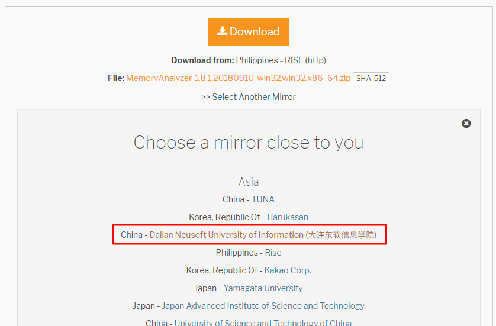
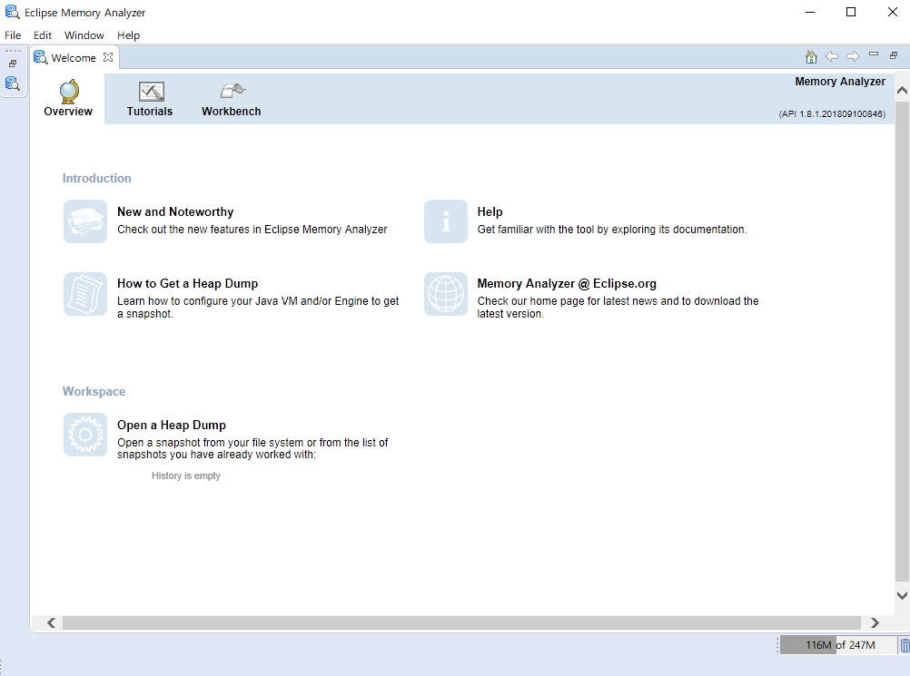
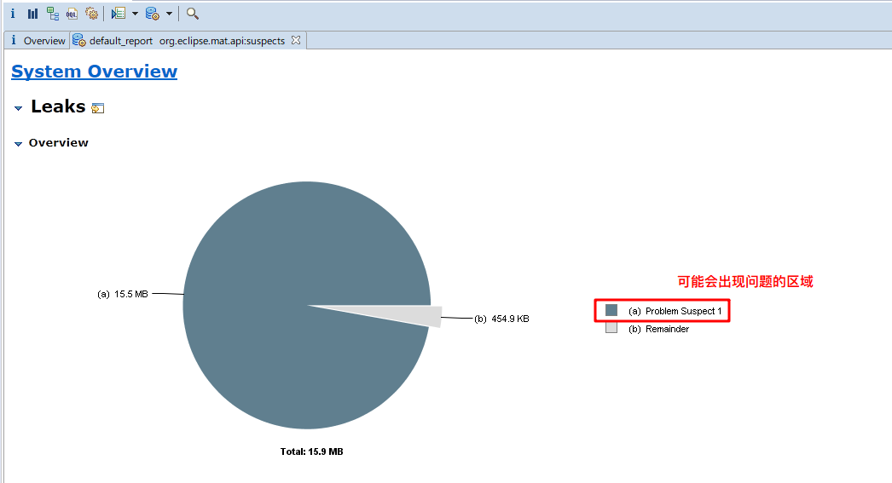
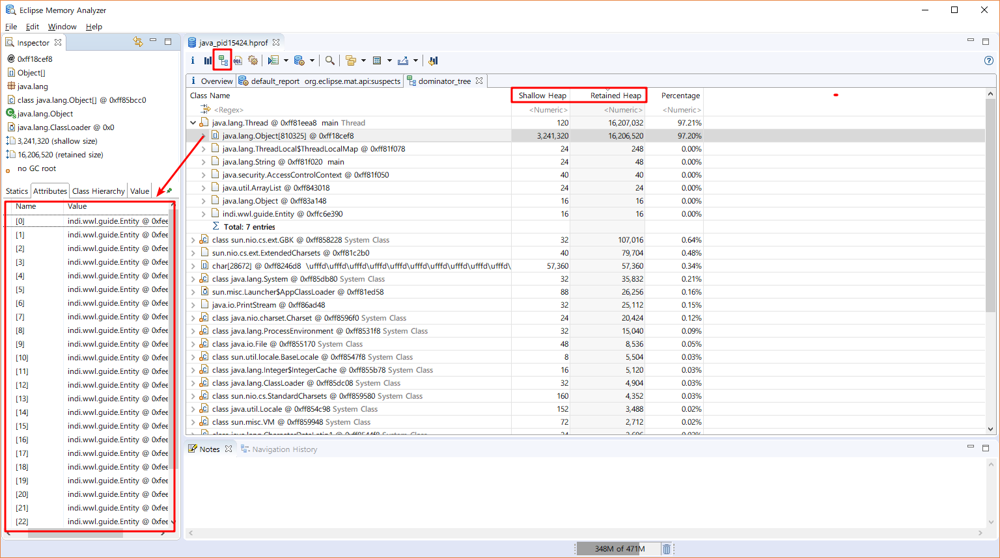
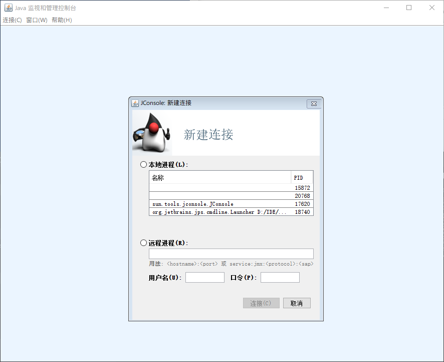
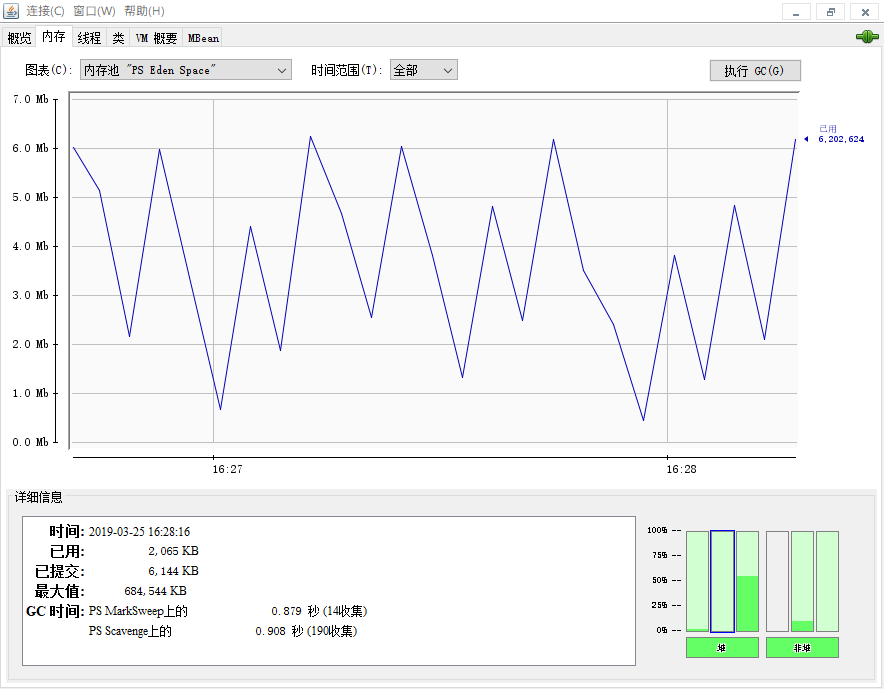
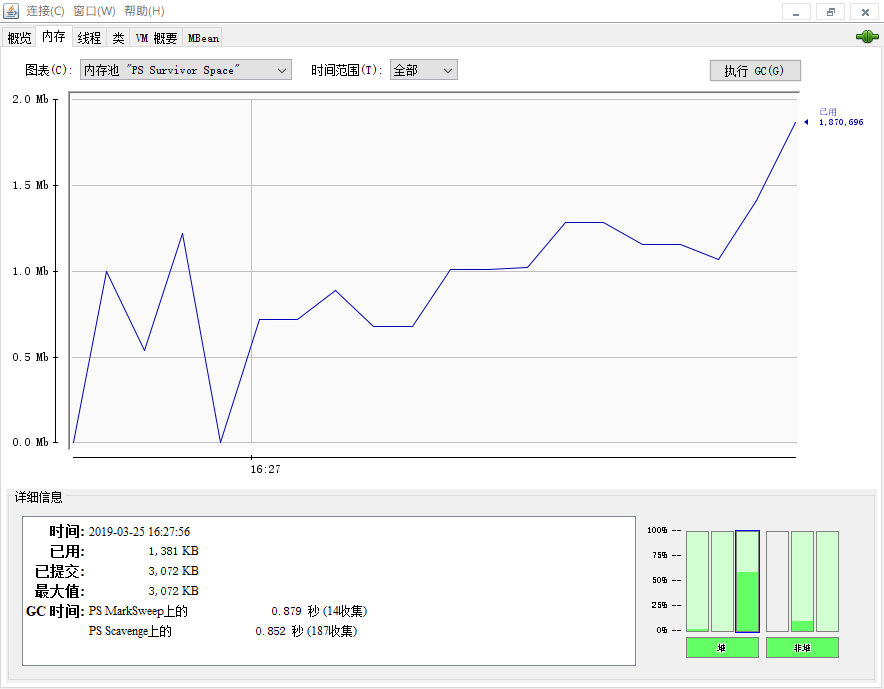

# 初体验：内存溢出的问题分析与解决

## 引入Demo

```javascript
public static void main(String[] args) {
    List<Entity> list = new ArrayList<>();
    while(true) {
        list.add(new Entity());
    }
}
```

运行一段时间后,会停止程序，报出内存溢出：
```
Exception in thread "main" java.lang.OutOfMemoryError: Java heap space
```
这是因为程序在不断地往list容器里添加新创建的对象Entity，而对象的存储是放在堆里，当虚拟机分配的堆内存越来越多，便导致了内存溢出。


## Memory Analyzer 定位分析与解决
配置运行参数VM arguments：堆存储快照以及分配堆内存(为了更快抛出异常)
``` 
-XX:+HeapDumpOnOutOfMemoryError -Xms20m -Xmx20m
```

堆存储快照默认保存在工程目录下，我们需要内存分析工具才能解析这个文件的内容

此处用的的Eeclipse的[Memory Analyzer](https://www.eclipse.org/mat/downloads.php)

在选择对应的版本之后，会跳转到下载页面，建议选择国内的镜像。


下载完成之后，直接解压，运行MemoryAnalyzer.exe



File->Open Heap Dump->选择之前生成堆快照->Getting Started->默认finsh

生成的概要信息:


生成堆内存的树信息，帮助我们查看：


- Shallow Heap：对象本身占用的内存大小
- Retained Heap：当前对象的大小+当前对象直接或间接引用对象
- Percentage：占用百分比

根据树信息，可以看出：
- main这个线程，本身占用内存小，但是其直接或间接引用对象部分占用了大部分的内存。
- 展开该线程树，又可以看到是Object这个对象高占用
- 根据左侧的，可以看到引用了很多的Entity对象

根据分析，再去定位到我们的代码，思考：
- 是代码问题还是分配虚拟机的内存的问题，再做修改。
- 显而易见，此次Demo是代码的问题，修改代码即可。

## 可视化监控我们的Java程序-JConsole

JConsole，是JKD给我们提供的Java监视和管理控制台，在JDK目录的bin中可找到，实际上是对lib目录下的tools的引用。

配置好Java环境之后，命令行：jconsole


利用代码,初步去探索JVM的堆内存中的新生代中划分：Eden、Survivor、Survivor等
（不同的垃圾回收器，划分不同）

示例代码：
``` java
public static void main(String[] args) {
    try {
        Thread.sleep(5000);	
    }catch (Exception e) {
        e.printStackTrace();
    }
    System.out.println("run...");
    
    fill(1000);
}

public static void fill(int x) {
    
    List<Entity> list = new ArrayList<>();
    for(int i=0; i<x; ++i) {
        try {
            Thread.sleep(100);
        } catch (InterruptedException e) {
            e.printStackTrace();
        }
        list.add(new Entity());
        //触发GC回收
        new Entity();
    }
}
```

监控情况：





