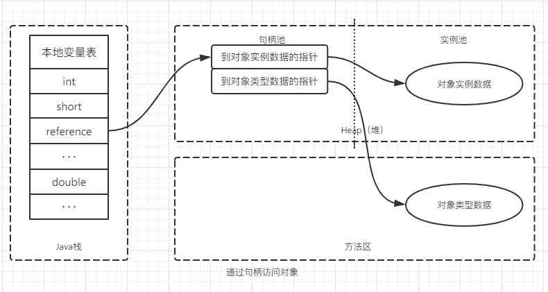
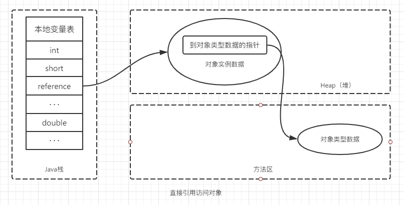

# 对象访问

Java语言中，对象访问是如何进行的?
最简单的访问，也会涉及到Java栈、Java堆、方法区三者之间的关联。

``` java
Object obj = new Object(); //出现在方法体中
```
“Object obj”这部分语义将反应到Java栈的本地变量表中，作为一个`refrence类型数据`出现。而“new Obeject”这部分语义反应到Java堆中，形成了存储Object类型实例所有数据值的结构化内存（根据具体的类型以及虚拟机实例不同，长度不固定）。此外，Java堆中还必须包含能查找到此对象类型数据（对象类型、父类、实现的接口、方法等等）的地址信息，这些类型数据存储在方法区中。

在JVM规范中只规定了`refrence类型`为一个指向对象的引用，而没有定义引用如何定位以及访问到Java堆中对象的方式（即栈定位并访问堆中对象信息的方式）。目前主流方式有两种：`使用句柄和直接指针。`

## 句柄引用
如果使用句柄访问，`Java堆中会划分出一块内存作为句柄池，reference中存储的是对象的句柄地址，而句柄中包含了两个地址信息，分别是对象实例数据和类型数据地址信息。`




## 直接引用
如果使用直接指针访问方式，Java堆对象的布局就要考虑`如何放置访问类型数据的相关信息`，`reference直接存储的就是对象地址。`



## 区别
句柄引用和直接引用两种对象访问方式各有优势。  

使用句柄引用的方式最大的优点是：reference中存储的是稳定的句柄地址，在对象被移动（GC时，移动对象是非常普遍的行为）时，只会改变句柄中的实例数据指针，而reference本身不需要被修改。

使用直接指针访问方式最大好处是速度更快，它节省了一次指针定位的时间开销，由于对象访问在Java中非常频繁，因此此类开销积少成多后也是一项非常可观的执行成本。

HotSpot采用直接引用的方式进行对象的访问。

