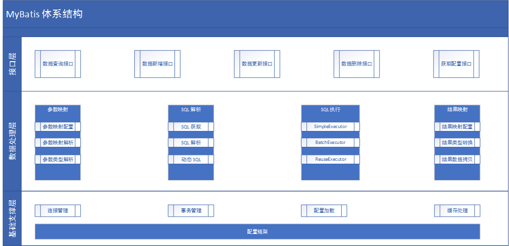
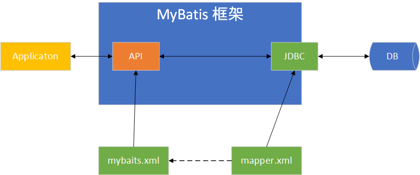

# MyBatis 简介

## 概述

MyBatis 是一个优秀的基于 Java 的持久层框架，它内部封装了 JDBC，使开发者只需关注 SQL 语句本身，而不用再花费精力去处理诸如注册驱动、创建 Connection、配置 Statement 等繁杂过程。

Mybatis 通过 xml 或注解的方式将要执行的各种 Statement（Statement、PreparedStatement 等）配置起来，并通过 Java 对象和 Statement 中 SQL 的动态参数进行映射生成最终执行的 SQL 语句，最后由 MyBatis 框架执行 SQL 并将结果映射成 Java 对象并返回。(ORM过程)

ps:注意扩展数据处理层过程、基础支撑层的缓存处理（页面置换算法：LRU、FIFO等)。

## MyBatis 与 Hibernate

Hibernate 框架是提供了全面的数据库封装机制的 “全自动” ORM，即实现了 POJO 和数据库表之间的映射，以及 SQL 的自动生成和执行。

相对于此，MyBatis 只能算作是 “半自动” ORM。其着力点，是在 POJO 类与 SQL 语句之间的映射关系。也就是说，MyBatis 并不会为程序员自动生成 SQL 语句。具体的 SQL 需要程序员自己编写，然后通过 SQL 语句映射文件，将 SQL 所需的参数，以及返回的结果字段映射到指定 POJO。因此，MyBatis 成为了“全自动”ORM 的一种有益补充。

Hibernate 提供了 `方言` 的概念， 要想实现全自动， 需要额外学习 HQL 方言，虽然是全自动，但是缺乏灵活性，而且在多表联查方面不友好，只在单表上有优势。此外，在效率方面，Hibernate对原生的JDBC进行了优化（懒加载、二级缓存），通常查询效率可以比原生快27倍，而MyBaits在性能上与Hibernate差异不大，甚至微微优于hibernate。但是主要的是MyBaits让代码与SQL的耦合性更低。

## MyBatis 的特点

* 在 XML 文件中配置 SQL 语句，实现了 SQL 语句与代码的分离，给程序的维护带来了很大便利。
* 因为需要程序员自己去编写 SQL 语句，程序员可以结合数据库自身的特点灵活控制 SQL 语句，因此能够实现比 Hibernate 等全自动 ORM 框架更高的查询效率，能够完成复杂查询。
* 简单，易于学习，易于使用，上手快。

