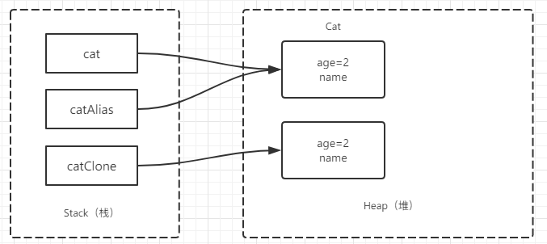
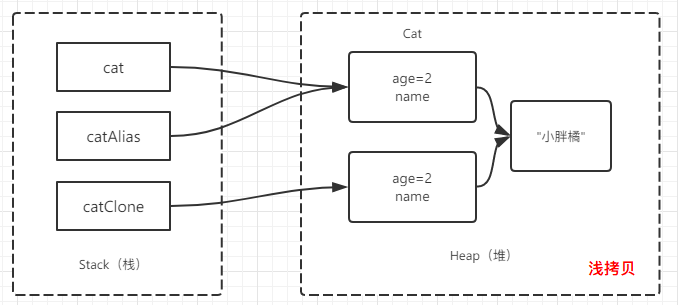
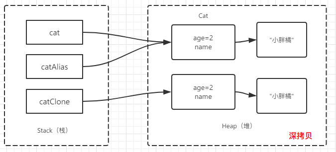

# clone对象与浅拷贝和深拷贝

# 为什么要clone对象
在实际编程中，我们常常会遇到这种情况：有两个相互独立的对象，都有各自的内存空间，操作互不影响，但其中一个对象的初始化是由另一个对象确定的。简单来说就是要复制一个对象，复制的对象是有单独内存空间的。在Java语言中，简单的赋值语句是不能满足这种需求。要满足这种需求虽然有很多途径，但实现clone()方法是其中最简单，也是最高效的手段。

# clone方法解析
Java语言中将clone的特性抽取了出来，封装在了顶级父类Object中：
``` java
protected native Object clone() throws CloneNotSupportedException;
```
从源码可以看到，
- 被protected修饰符修饰。意味必须在同一个包或继承Object类，才能使用clone()方法，而Java所有类缺省继承Object类，所以`需要覆盖clone()方法并调用super.clone()，同时为了能让其他类调用，需要把clone（）方法的访问权限修饰改为public`。
- 是一个native方法，调用底层操作系统的方法创建对象，比直接new创建对象效率高。  
- 返回的是Object对象。必须进行强制转换才能得到我们要的类型。
- 抛出一个CloneNotSupportedException异常。官方API对此描述是：`如果对象的类不实现Cloneable接口。覆盖了clone方法的子类会抛出此异常以指示实例无法克隆。` 
	``` java
	public interface Cloneable{
	}
	```
	从源码可以看到，Cloneable接口不包含任何方法。Cloneable接口其实是一个clone标志,是为了保护Object.clone()的，如果clone类没有实现此接口，并调用了super.clone(),那么Object的clone()就会抛出 CloneNotSupportedException 异常。`所以实现此接口的类应使用public覆盖Object.clone()以标识此类是可clone的。`
	
	>注意的是所有数组都被认为是实现接口Cloneable，并且数组的clone方法的返回类型是`T[] `，其中T是任何引用或原始类型。

# clone实例（对象）的类需要的条件
- 类实现Cloneable接口
- public覆盖Object.clone()方法
- 在覆盖的clone()方法中调用super.clone()

``` java
package indi.wwl.entity;

public class Cat implements Cloneable{
	private int age;
	private String name;
	
	public Cat() {}
	
	public Cat(int age, String name) {
		super();
		this.age = age;
		this.name = name;
	}

	@Override
	public Object clone() throws CloneNotSupportedException {
		System.out.println("super Class: "+super.getClass().getName());
		return super.clone();
	}

	//...setters And getters	
}

``` 

>tips：这里的super指的是被clone对象的类。

# clone方法是浅拷贝
根据对对象的“copy”程度和方式的不同，分为两种拷贝方式：浅拷贝和深拷贝。
- `浅拷贝`：复制了对象的引用地址，两个对象指向同一个内存地址，所以修改其中任意的值，另一个值都会随之变化。
- `深拷贝`：将对象及值复制过来，两个对象修改其中任意的值另一个值不会改变。

那么clone方法是浅拷贝还是深拷贝？

复制对象与复制引用：
``` java
	public static void cloneDemo1() {
		Cat cat = new Cat(2,"小胖橘");
		Cat catAlias = cat;
		println(cat);
		println(catAlias);
		Cat catClone = null;
		try {
			catClone = (Cat)cat.clone();
		} catch (CloneNotSupportedException e) {
			e.printStackTrace();
		}
		println(catClone);
	}
	/* Output:
	 * indi.wwl.entity.Cat@42a57993
	 * indi.wwl.entity.Cat@42a57993
	 * super Class: indi.wwl.entity.Cat
	 * indi.wwl.entity.Cat@75b84c92
	 * */
```
  
对象赋值操作（=），使得cat、catAlias都指向了同一个对象，这是引用的复制，catAlias也叫cat指向对象的别名。
clone方法复制了对象，在堆内存中创建新的空间，返回了副本的引用，使得catClone指向了副本对象的引用，这是复制对象。

起初，我认为既然clone()方法返回的clone对象引用地址和被克隆对象的引用地址不相同，那么他就是深拷贝。其实，这想法是错误的，`因为忽略了clone对象的属性`。我们知道对象的属性有基本类型和引用类型，基本类型的拷贝基本没有异议，直接将数值复制过来即可，而真正值得我们关注的是引用类型的属性，也就是`catClone实例中的name属性是浅拷贝还是深拷贝？`

``` java
println(cat.getName()==catClone.getName()); //true
```
  
可以看到name应用的是用一个Sting对象，所以`clone方法其实是浅拷贝,在实际编程中要注意这一点`!

# clone方法实现深拷贝
如果要实现对象的深拷贝，在覆盖的clone方法内操作即可。把对象引用的对象也进行clone即可，不过要求被引用的对象的类也要满足clone的条件：实现Cloneable接口，覆盖clone方法。

此处引用的是String对象，比较特殊，如果是普通的引用对象满足上面所说就可以：
``` java
	@Override
	public Object clone() throws CloneNotSupportedException {
		System.out.println("super Class: "+super.getClass().getName());
		Cat cloneObj = (Cat)super.clone();
		cloneObj.name = new String(name);
		return cloneObj;
	}
```
``` java
println(cat.getName()==catClone.getName());//false
```
  

`注意，clone方法实现彻底深拷贝，基本不可能实现。`因为clone的对象除了本身有引用对象外，这些引用对象也可以有引用对象，即彻底深拷贝要考虑到引用对象的深度会很深，基本不可能实现。


# 总结：
clone方法创建并返回此对象的副本，副本取决于对象的类。clone对象的类需要实现Cloneable，public覆盖clone()方法，在方法中调用super.clone(),可以在clone()方法对clone对象的引用对象进行clone实现深拷贝，至于彻底深拷贝，几乎是不可能实现的。

>推荐阅读： 
- [java.lang.Object.clone()分析](http://www.cnblogs.com/gw811/archive/2012/10/07/2712252.html)
- [详解java中的clone方法](https://blog.csdn.net/u011514810/article/details/52345113)
- [Java中clone( )和new效率比较](https://blog.csdn.net/iblade/article/details/80749148)