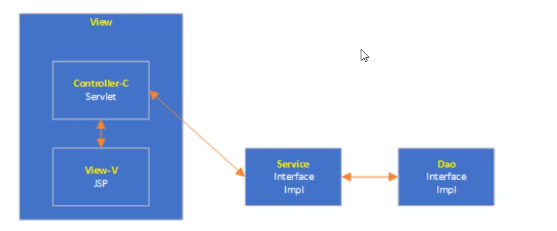

# MVC模式

## 什么是MVC模式

MVC，即`Model模型、View视图及Controller控制器`。

* View：视图，为用户提供使用界面，与用户直接进行交互。
* Model：模型，承载数据，并对用户的提交请求进行计算的模块。分为两类，一类称为`数据模型`，一类称为`业务模型`。所谓数据模型是指实体类，`专门承载业务数据`的，如Student、User等。而业务模型则是指`Service或Dao对象`，专门用于处理用户提交请求。
* Controller：控制器，用于将用户求转发给相应的的Model进行处理，并根据Model的计算结果向用户提供相应响应。

## MVC架构程序的工作流程

* 用户通过View页面向服务端提出请求。可以是表单请求、超链接请求、AJAX请求等
* 服务端Controller控制器接收到请求后对请求进行解析，找到相应的Model对用户请求进行处理
* Model处理后，将处理结果再交给Controller
* Controller在接到处理结果后，根据处理结果找到作要作为向客户端发回的晌应View页面。页面经渲染（数据填充〕后，再发送给客户端。

## 三层架构 与 MVC 模式

MVC模式其实是应用在三层架构中的view层。MVC模式将三层架构中的view层进行了解耦。传统开发中（servlet服务器小程序）负责处理业务逻辑以及页面展示，之后的JSP技术专门用来处理页面展示，但是实际上JSP就是servlet，所以它也是可以处理业务逻辑的。（类似于.net的.aspx)。`view层被进一步划分为Controller、View。`在Java中就是Servlet、JSP。

注：MVC模式并不是一种设计模式。