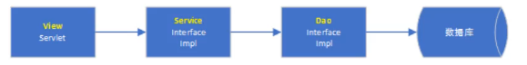

# 三层架构

## 什么是系统架构

系统架构是指，`整合应用系统程序大的结构`。经常提到的系统结构有两种：`三层架构与MVC`。这两种结构既有区别，又有联系。但这两种结构的使用，均是为了`降低系统模块间的耦合度，降低系统的复杂度`。

## 什么是三层架构

三层架构属于系统架构的一种。三层架构是指：`视图层View`、`服务层Service`、`持久层DAO`。它们分别完成不同的功能。

* View层（视图层）：用于接收用户提交请求的代码
* Service层（业务逻辑层）：系统的业务逻辑主要在这里完成
* DAO层（数据访问层）：直接操作数据库的代码

架构层命名原则：`约定优于配置`

为了`更好的降低各层间的耦合度`，在三层架构程序设计中，采用`面向抽象编程`。即上层对下层的调用，是通过接口实现的。而下层对上层的真正服务提供者，是下层接口的实现类。`服务标准〔接口）是相同的，服务提供者（实现类）可以更换`。这就实现了层间解耦合。

案例：`c#-petshop项目`

拓展：

为什么要用数据库？数据库解决数据读写、存储、检索效率的问题。

开发中，`业务才是核心，技术辅助业务。`通常，业务越复杂，系统的耦合度越高，对于业务的复杂度，使用事务来衡量。

* 简单业务：只开启一个事务
* 普通业务：开启三个事务
* 复杂业务：开启七个事务

解决办法：多张表之间有依赖关系，说明有强关联，这个时候要想办法分拆业务。

关于代码开发，实现高内聚、低耦合的原则：

* 一个类只做一种事：高内聚
* 一个方法只做一件事
* 写且写一次

