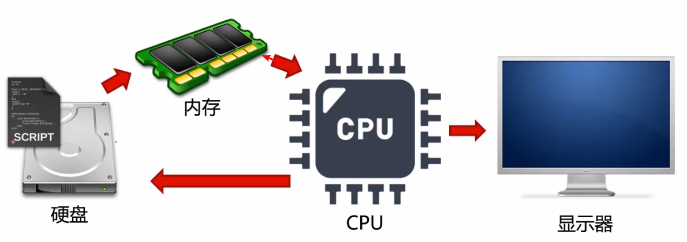
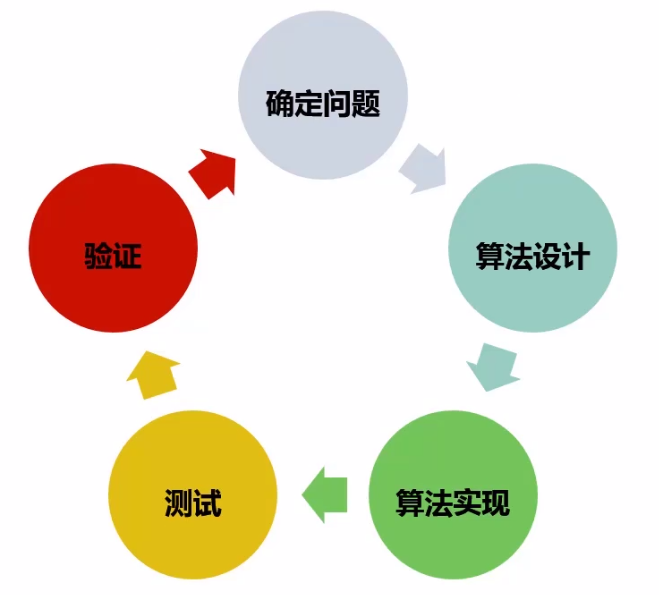

#计算机与程序设计

#什么是计算机？
- 根据一系列指令对数据进行处理的工具或机器。
- 特征：
  - 可以进行数据计算
  - 根据指令执行任务
- 组成（冯诺依曼机）
  - 运算器 + 控制器 （CPU)
  - 存储器 (内存以及硬盘)
  - 输入设备和输出设备

# 计算机工作过程-IPO
- 输入（Input）：程序用到的数据
- 处理（Process）：编写的程序放在存储器中用于数据处理操作
- 输出（Output）：对处理或计算过的数据进行输出

# 程序执行过程

# 程序编写步骤
