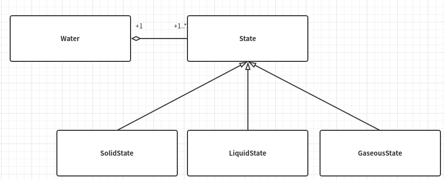

# 状态模式

## 从生活中领悟状态模式

&emsp;&emsp;人有少、壮、老：少年活泼可爱，壮年活力四射，老年充满智慧。水有固、液、气：固态-冰，坚硬寒冷，液态-水，清澈温暖，气态-水蒸气，虚无缥缈。有趣的是，水的三种状态可以互相转换。

## 从剧情中思考状态模式

&emsp;&emsp;用程序编程实现水之间的状态转换。类图如下：Water包含State（抽象类），SolidState、LiquidState、GaseousState分别实现State。



``` python
# 状态模式-水的三种状态（固液气）转变

from abc import ABCMeta, abstractmethod


class Water:
    """水"""

    def __init__(self, state):
        self.__temperature = 25  # 默认常温25°
        self.__state = state  # 状态

    def setState(self, state):
        self.__state = state

    def changeState(self, state):
        if (self.__state):
            print("由", self.__state.getName(), "变为", self.__state.getName())
        else:
            print("初始化为", state.getName())
        self.__state = state

    def getTemperature(self):
        return self.__temperature

    def setTemperature(self, temperature):
        self.__temperature = temperature
        if (self.__temperature <= 0):
            self.setState(SolidState("固态"))
        elif (self.__temperature <= 100):
            self.setState(LiquidState("液态"))
        else:
            self.setState(GaseousState("气态"))

    def riseTemperature(self, step):
        self.setTemperature(self.__temperature + step)

    def reduceTemperature(self, step):
        self.setTemperature(self.__temperature - step)

    def behavior(self):
        self.__state.behavior(self)


class State(metaclass=ABCMeta):
    """状态类"""

    def __init__(self, name):
        self.__name = name

    def getName(self):
        return self.__name

    @abstractmethod
    def behavior(self, water):
        """不同状态下的行为"""
        pass


class SolidState(State):
    """固态"""

    def __init__(self, name):
        super().__init__(name)

    def behavior(self, water):
        print("我性格高冷，当前体温" + str(water.getTemperature()) +
              "℃,我坚如钢铁，仿如一冷血动物，请用我砸人，嘿嘿……")


class LiquidState(State):
    """液态"""

    def __init__(self, name):
        super().__init__(name)

    def behavior(self, water):
        print("我性格温和，当前体温" + str(water.getTemperature()) +
              "℃，我可滋润万物，饮用我可让你活力倍增……")


class GaseousState(State):
    """气态"""

    def __init__(self, name):
        super().__init__(name)

    def behavior(self, water):
        print("我性格热烈，当前体温" + str(water.getTemperature()) +
              "℃，飞向天空是我毕生的梦想，在这你将看不到我的存在，我将达到无我的境界……")


def test():
    water = Water(LiquidState("液态"))
    water.behavior()
    water.setTemperature(-4)
    water.behavior()
    water.riseTemperature(18)
    water.behavior()
    water.reduceTemperature(110)
    water.behavior()


if __name__ == "__main__":
    test()

"""
我性格温和，当前体温25℃，我可滋润万物，饮用我可让你活力倍增……
我性格高冷，当前体温-4℃,我坚如钢铁，仿如一冷血动物，请用我砸人，嘿嘿……
我性格温和，当前体温14℃，我可滋润万物，饮用我可让你活力倍增……
我性格高冷，当前体温-96℃,我坚如钢铁，仿如一冷血动物，请用我砸人，嘿嘿……
"""
```

### 什么是状态模式

> &emsp;&emsp;Allow an object to alter its behavior when its iternal state changes.The object will appear to change its class.  
> &emsp;&emsp;允许一个对象在其内部状态发生改变时改变其行为，使这个对象看上去就像改变了它的类型一样。

&emsp;&emsp;如水一般，`状态`即事物所处的某一种形态。`状态模式`是说一个对象在其内部状态发生改变的时候，其表现的行为和外在属性不一样，这个对象看上去就像改变了它的类型一样。因此，状态模式又被称为`对象的行为模式`。

### 状态模式的设计思想

&emsp;&emsp;状态模式的核心思想就是一个事物（对象）有多种状态，在不同的状态下所表现的行为和属性不一样。

## 状态模式的模型抽象

&emsp;&emsp;针对上述程序中的基本思想以及当中的一些缺点：首先setTemperature(self, temperature)不符合程序的开放封闭原则，因为如果有多一个状态，则需要增加一个if else判断。然后，表示状态的类应该要使用单例的方式去实现。针对问题，进一步重构和优化，得到状态模式的框架模型。

### 状态模式的框架模型


### 基于框架实现

### 模型说明

## 实战应用

## 应用场景