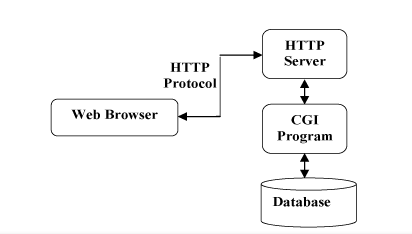

# CGI是什么

CGI，全称是Common Gateway Interface，即通用网关接口。CGI年代久远，基本被淘汰。但是因为第一次接触到这个名词，出于好奇还是了解了一下。

## CGI是用来解决什么的？
最早的Web服务器响应完全是静态的。即简单地响应Brower发来的HTTP请求，并将存储在服务器上的HTML文件返回给Brower。但是随着网站越来越复杂，便出现了动态技术需求。首先可以实现动态技术的语言有很多，C、C++、Java、PHP、perp等，此外为了统一服务器之间的信息交流，就互相之间做了个约定，便是CGI协议。那么遵守CGI接口规范而编写的程序，就称为CGI程序。

```
sun公司推出了servlet基本上取代了CGI。接着又推出了JSP试图取代servlet。随着时代的变化，模板引擎的出现，前端的崛起、架构上的改变等原因，JSP也会被前后端分离取代。
```

## CGI统一了服务器之间的信息交流
CGI的学名是通用网关接口，什么是网关？联通一个网络和另一个网络的通道。所以CGI可以理解为连通web服务器之资源（如：数据库、文件）的一个通道。这个接口定义了web服务器在操作其权限范围以外的资源时需要遵循的规范及数据传递的方式。
所以按照web服务器的设计规范来说，web服务器只能操作它根目录下的相关文件。如果遵循了CGI规范，服务器就可以操作之外的资源，服务器之间可以实现信息交流。


## 什么是CGI程序和CGI处理步骤
实现了CGI规范而编写的程序。绝大多数的CGI程序被用来解释处理来自表单的输入信息，并在服务器产生相应的处理，或将相应的信息反馈给浏览器。CGI程序使网页具有交互功能。

例如：
我们在表单中有一个叫做Action的属性，`<Form action="xxx">`首先这个请求会被发送到web服务器。

然后web服务器根据你发过来URL请求找到相对应的CGI程序（如:login.php）。

然后web服务器会把数据按照CGI的接口标准传递给相应的CGI程序，对应的CGI程序处理过请求后，会返回数据，或者文件（一般是HTMl）给服务器。

服务器会把结果返回给浏览器，浏览器负责呈现用户请求的处理结果。

CGI处理步骤：
- 通过Internet把用户请求送到服务器。
- 服务器接收用户请求并交给CGI程序处理。
- CGI程序把处理结果传送给服务器。
- 服务器把结果送回到用户。



## 回看标准CGI的定义
接下来回头看一下，百度百科给的定义,就会比较好理解:

CGI：是Web 服务器运行时外部程序的规范,按CGI 编写的程序可以扩展服务器功能。CGI 应用程序能与浏览器进行交互,还可通过数据库API 与数据库服务器等外部数据源进行通信,从数据库服务器中获取数据。格式化为HTML文档后，发送给浏览器，也可以将从浏览器获得的数据放到数据库中。[--来自百度百科](https://baike.baidu.com/item/CGI/607810?fr=aladdin&fromid=6717913&fromtitle=%EF%BC%A3%EF%BC%A7%EF%BC%A9)


# 总结
    CGI,即通用网关接口协议，它是早期服务器为了实现动态网站以及服务器之间信息交流而共同遵守的一种协议。实现CGI协议的称程序之称为CGI程序,CGI程序可以由多种语言实现，它可以帮组服务器之间进行信息交流。是在是WWW技术中最重要的技术之一，有着不可替代的重要地位。目前ASP、PHP等是靠CGI在解析。


参考:
- [我所了解的cgi](http://www.cnblogs.com/liuzhang/p/3929198.html)
- [WEB那点事 -- （一）CGI 是什么玩意](https://blog.csdn.net/java_sanxin/article/details/51496688)
- [CGI是什么？](https://baike.1688.com/doc/view-d2345637.html#menu1)
