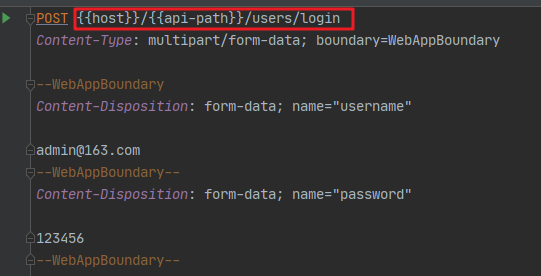

# IDEA-Http Client 轻量级调试接口

现在的项目基本上都已经是前后端分离了，前后端分离需要前端工程师和后端工程师的密切配合，后端工程师必须要反复测试手里的接口没有问题才可以交付给前端工程师。

很多开发人员用的接口测试工具是 Postman、 Talend API Tester 、Swagger等等 ,作为一个后端程序员，我用的比较多的是 Postman，一直感觉这个工具很方便，除了能够测试接口、还可以做测试脚本、支持环境变量等等。今天要介绍的 Http Client 是相对 Postman 来说，是个更轻量级、文档化的接口调试工具，它是 IDEA 的一个免费插件。

## Http Client

Http Client 是 Intellij Idea 上的一款免费的插件，该插件是通过文件的方式去完成对接口调试的编写、测试和结果的存储。

安装过程也很简单，打开 IDAE Settings -> Plugins 在 Marketplace 直接搜索 Http Client 然后 Install即可（最新的 IDEA 默认安装了该插件）：


## 创建 .http 文件

创建一个你需要测试接口的文件夹，我通常喜欢在项目的 test 文件夹下面新建一个 http 的文件夹，这个文件夹下面存放我的测试接口文件，这个根据个人习惯而定。 选中文件夹，右键选择 `New -> New Http Request `, 输入文件名称即可（根据模块命名方便归类），新建的文件如下：


可以看见文件上方有一下的菜单选项：
* Run All Requests in File : 可以选择你设置的环境变量，运行文件定义的所有请求。
* Add Requsest：添加一个请求。官方提供了五种请求方式，基本能够满足日常开发调试需求。
* Add Environment File： 设置环境变量文件。
* Convert from cURL：复制一个请求，根据URL。
* Open Log：log 日志，该日志包含了请求的全部信息，包括请求的返回值信息等。
* Examples：官方提供的例子。几乎所有的常见请求示例，官方都提供了很好的用例。

本文只对简单的GET 和 POST 请求做示例：

## GET Request

步骤：Add Requsest -> Get Request，或者 使用快捷键 `'gtrp' and 'gtr'` 生成模板，基于模板修改即可：


点击左侧的，三角图标，即可调试：


可以通过 Open Log 查看日志。每当我们在文件当中建立一个请求测试完成以后，都会有一个 log 日志生成，该日志包含了请求的全部信息，包括请求的返回值信息等，日志我们也可以用来运行测试等，所有的日志存在项目文件夹 `.idea -> httpRequests` 文件夹下面，.json 格式记录的是请求返回值，.http 格式文件记录了请求历史和请求返回值存在的 json 文件信息等：


## POST Text Body

注：POST接口示例都使用了同一个接口，只改变了接收参数的方式。

步骤：Add Requsest -> POST Text Body，基于生成的模板，或者 使用快捷键 `'ptr' and 'ptrp'` 生成模板，基于模板修改即可：


## POST Form with a Text Field

步骤：Add Requsest -> POST Form with a Text Field，基于生成的模板，或者 使用快捷键 `'ptr' and 'ptrp'` 生成模板，基于模板修改即可：


## 定义全局变量

有时候我们在请求接口的时候会发现有些数据是接口之间共用的，比如请求的 host ，常用的请求头等等，通常会定义全局变量复用，定义全局变量的文件是一个 json 文件，文件名固定为 http-client.env.json。

步骤： Add Environment File -> Regular：


如上所示，我定义两组参数 dev 和 test , 当我在测试运行接口的时候，我们就可以选择用哪组参数运行接口，通过 `{{ }}`的方式引用变量，比如我测试下面这个接口：




## 每个接口方便的传 token

现在很多接口访问都需要传 token , token具有时效，一段时间或者token刷新，往往需要重新调用授权接口，获取新的 token，如果手动制黏贴真的很麻烦，现在我们来解决这个问题。

假设示例中的第一个 Get 接口需要 带上 token 才能访问，我们要做的就是将每次登录接口返回的token 更新到 Get 接口中，也就是说 我们需要定义个 `可变的全局变量` , 这里我定义为 auth_token。

`在获取token的接口加入下面一行代码`，注意参数 : `response.body.data.token`，根据实际接口返回的response.body决定。

``` javascript
> 
```


同样通过 `{{ }}` 引用即可：


## 总结
Http Client可以让我们便捷、快速得去测试 API 接口，而且可以以文件的方式纳入版本管理控制中。文章篇幅有限，只列举了简单的使用方式，插件的官方Examples中提供了不少示例，可以供我们参考实现。


参考链接：
1. https://zhuanlan.zhihu.com/p/100907696
